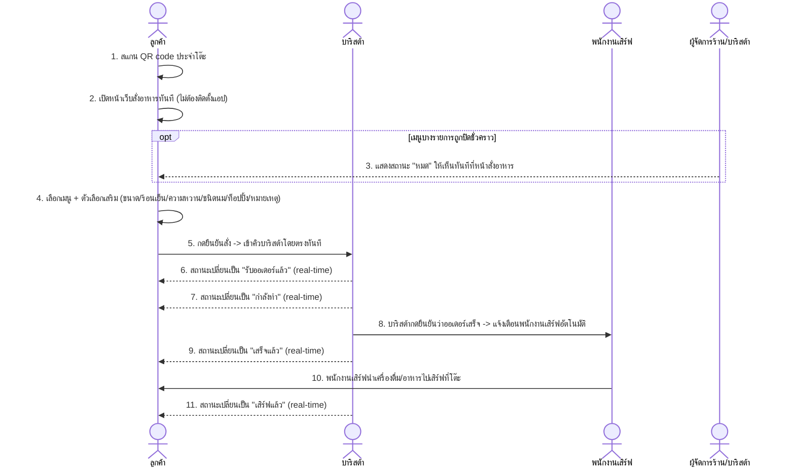

# User Journey — ระบบสั่งกาแฟจากโต๊ะด้วยการสแกน QR Code

**อ้างอิง Requirement:** [[../../01-requirements/01-spec/20260802-001-table-qr-ordering|20260802-001]]
**วันที่:** 2026-08-15
**สถานะ:** ร่าง (Draft)

## Diagram

## คำอธิบายตามลำดับ

1. ลูกค้านั่งที่โต๊ะแล้วสแกน QR code ประจำโต๊ะนั้น
2. หน้าเว็บสั่งอาหาร/เครื่องดื่มเปิดขึ้นทันทีโดยไม่ต้องติดตั้งแอปพลิเคชันใด ๆ
3. ถ้าเมนูรายการใดถูกปิดชั่วคราว (สินค้าหมด) ลูกค้าต้องเห็นสถานะ "หมด" ทันทีบนหน้าสั่งอาหาร
4. ลูกค้าเลือกเมนูพร้อมปรับตัวเลือกเสริมครบทุกมิติ (ขนาด, ร้อน/เย็น, ความหวาน, ชนิดนม, ท็อปปิ้ง/เพิ่มช็อต, หมายเหตุแบบ free text)
5. ลูกค้ากดยืนยันสั่ง ออเดอร์เข้าคิวของบาริสต้าโดยตรงทันที โดยไม่ผ่านพนักงานเสิร์ฟกดรับก่อน
6. ลูกค้าเห็นสถานะ "รับออเดอร์แล้ว" แบบ real-time บนหน้าจอที่ใช้สั่ง
7. สถานะเปลี่ยนเป็น "กำลังทำ" เมื่อบาริสต้าเริ่มทำเครื่องดื่ม/อาหาร
8. เมื่อบาริสต้ากดยืนยันว่าออเดอร์ทำเสร็จ ระบบแจ้งเตือนพนักงานเสิร์ฟโดยอัตโนมัติทันที
9. ลูกค้าเห็นสถานะเปลี่ยนเป็น "เสร็จแล้ว"
10. พนักงานเสิร์ฟนำเครื่องดื่ม/อาหารไปเสิร์ฟที่โต๊ะของลูกค้า
11. สถานะเปลี่ยนเป็น "เสิร์ฟแล้ว" ปิด flow ของออเดอร์นี้

## Mapping กลับไป Requirement

| ขั้นตอนใน Diagram | อ้างอิงใน Spec |
|---|---|
| 1–2 | Scope (In scope): "หน้าเว็บสั่งอาหาร/เครื่องดื่มที่เปิดได้ทันทีจากการสแกน QR code ประจำโต๊ะ โดยไม่ต้องติดตั้งแอป" |
| 3 | Business Rules: "เมื่อเมนูรายการใดถูกปิดชั่วคราว ต้องซ่อนหรือแสดงสถานะ 'หมด' ให้ลูกค้าเห็นทันทีที่หน้าสั่งอาหาร" |
| 4 | Scope (In scope): "การเลือกเมนูพร้อมตัวเลือกเสริมครบทุกมิติ ... และช่องหมายเหตุพิเศษแบบ free text" |
| 5, 8 | Business Rules: "ออเดอร์ที่ลูกค้ายืนยันแล้วจะเข้าคิวของบาริสต้า/คนชงกาแฟโดยตรงทันที ไม่ต้องผ่านพนักงานเสิร์ฟกดรับก่อน" และ "เมื่อบาริสต้ากดยืนยันว่าออเดอร์ทำเสร็จ ระบบต้องแจ้งเตือนพนักงานเสิร์ฟโดยอัตโนมัติทันที" |
| 6, 7, 9, 11 | Business Rules: "ลูกค้าต้องเห็นสถานะออเดอร์ของตัวเองแบบ real-time ตลอดเวลาบนหน้าจอที่ใช้สั่ง" |
| 10 | ความต้องการ (Requirement): "พนักงานเสิร์ฟ — รับการแจ้งเตือนอัตโนมัติเมื่อออเดอร์ทำเสร็จ แล้วนำไปเสิร์ฟที่โต๊ะ" |

## เอกสารที่เกี่ยวข้อง

- [[../../01-requirements/01-spec/20260802-001-table-qr-ordering|spec ต้นทาง]]
- [[../02-technical/index|02-technical]]
