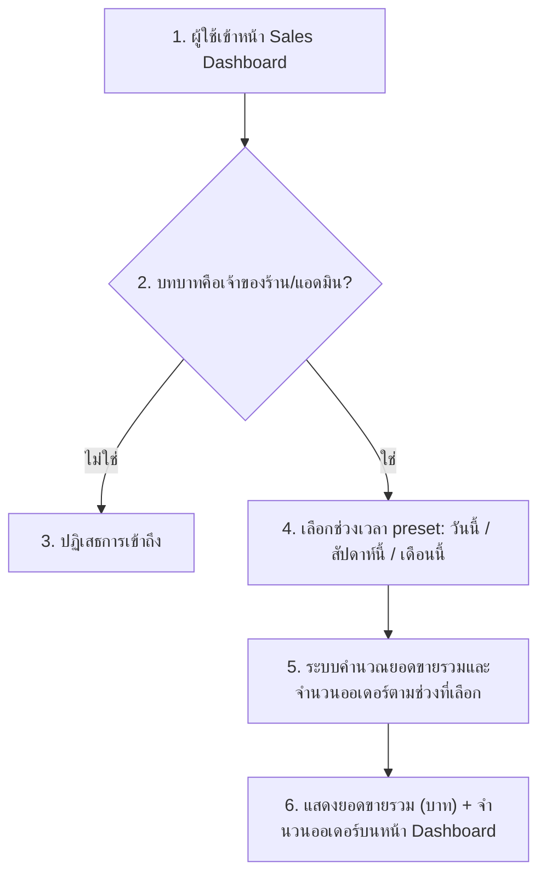

# User Journey — หน้า Dashboard ดูยอดขาย

**อ้างอิง Requirement:** [[../../01-requirements/01-spec/20260802-002-sales-dashboard|20260802-002]]
**วันที่:** 2026-08-15
**สถานะ:** ร่าง (Draft)

## Diagram

## คำอธิบายตามลำดับ

1. ผู้ใช้เข้าหน้า Sales Dashboard
2. ระบบตรวจสอบบทบาทของผู้ใช้ก่อนแสดงข้อมูล
3. ถ้าไม่ใช่บทบาทเจ้าของร้าน/แอดมิน ระบบปฏิเสธการเข้าถึงทันที
4. ถ้าเป็นเจ้าของร้าน/แอดมิน ผู้ใช้เลือกช่วงเวลาจาก preset ที่มีให้เท่านั้น (ไม่มี custom date range)
5. ระบบคำนวณยอดขายรวมและจำนวนออเดอร์ตามช่วงเวลาที่เลือก
6. แสดงผลยอดขายรวม (จำนวนเงิน) และจำนวนออเดอร์บนหน้า Dashboard

## Mapping กลับไป Requirement

| ขั้นตอนใน Diagram | อ้างอิงใน Spec |
|---|---|
| 1–2 | ความต้องการ (Requirement): "หน้านี้จำกัดสิทธิ์การเข้าถึงเฉพาะเจ้าของร้าน/แอดมินเท่านั้น" |
| 3 | Business Rules: "เฉพาะผู้ใช้ที่มีบทบาทเจ้าของร้าน/แอดมินเท่านั้นที่เข้าถึงหน้า dashboard นี้ได้ บทบาทอื่นไม่มีสิทธิ์เข้าถึง" |
| 4 | Scope (In scope): "ตัวเลือกช่วงเวลาแบบ preset สำเร็จรูป: 'วันนี้', 'สัปดาห์นี้', 'เดือนนี้'" และ Business Rules: "ไม่มีการเลือกช่วงวันที่แบบกำหนดเอง" |
| 5–6 | Scope (In scope): "หน้า dashboard แสดงยอดขายรวม (จำนวนเงิน) ตามช่วงเวลาที่เลือก" และ "แสดงจำนวนออเดอร์ตามช่วงเวลาที่เลือก" |

## เอกสารที่เกี่ยวข้อง

- [[../../01-requirements/01-spec/20260802-002-sales-dashboard|spec ต้นทาง]]
- [[../02-technical/index|02-technical]]
