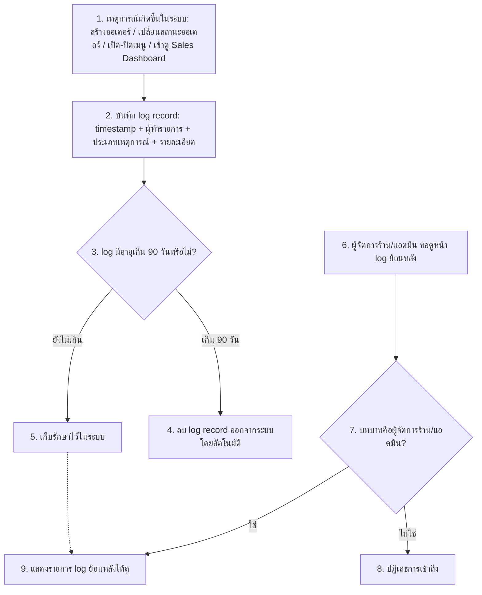

# User Journey — ระบบบันทึก Log (Audit Trail)

**อ้างอิง Requirement:** [[../../01-requirements/01-spec/20260802-003-audit-log|20260802-003]]
**วันที่:** 2026-08-15
**สถานะ:** ร่าง (Draft)

## Diagram

## คำอธิบายตามลำดับ

1. เหตุการณ์สำคัญเกิดขึ้นในระบบ (สร้างออเดอร์ใหม่, เปลี่ยนสถานะออเดอร์, เปิด/ปิดเมนูชั่วคราว, หรือมีการเข้าดูหน้า Sales Dashboard)
2. ระบบบันทึก log record ทันที โดยระบุ timestamp, ผู้ทำรายการ (user/role), ประเภทเหตุการณ์ และรายละเอียดที่เกี่ยวข้อง
3. ระบบตรวจสอบอายุของ log record แต่ละรายการ
4. ถ้า log มีอายุเกิน 90 วัน ระบบลบออกจากระบบโดยอัตโนมัติ
5. ถ้ายังไม่เกิน 90 วัน log ยังถูกเก็บรักษาไว้ในระบบ พร้อมให้เรียกดูได้
6. ผู้จัดการร้าน/แอดมินเข้าหน้าดู log ย้อนหลัง
7. ระบบตรวจสอบบทบาทของผู้ใช้ที่ร้องขอ
8. ถ้าไม่ใช่บทบาทผู้จัดการร้าน/แอดมิน ระบบปฏิเสธการเข้าถึง
9. ถ้าเป็นบทบาทที่ถูกต้อง ระบบแสดงรายการ log ย้อนหลัง (จาก log ที่ยังไม่ถูกลบในขั้นตอนที่ 5) ให้ดู

## Mapping กลับไป Requirement

| ขั้นตอนใน Diagram | อ้างอิงใน Spec |
|---|---|
| 1 | Scope (In scope): เหตุการณ์ที่ต้องบันทึก log ทั้งหมด (สร้างออเดอร์, เปลี่ยนสถานะออเดอร์, เปิด/ปิดเมนู, เข้าถึง sales dashboard) |
| 2 | Business Rules: "ทุก log record ต้องมี timestamp, ผู้ทำรายการ (user/role), ประเภทเหตุการณ์ และรายละเอียดที่เกี่ยวข้อง" |
| 3–4 | Business Rules: "Log ที่มีอายุเกิน 90 วันต้องถูกลบออกจากระบบโดยอัตโนมัติ (ตามหลัก data minimization)" |
| 5 | Scope (In scope): "นโยบายเก็บรักษา log: เก็บไว้ 90 วัน แล้วลบทิ้งอัตโนมัติ" |
| 6–9 | Business Rules: "เฉพาะบทบาทผู้จัดการร้าน/แอดมินเท่านั้นที่เข้าถึงหน้าดู log ย้อนหลังได้ บทบาทอื่นไม่มีสิทธิ์เข้าถึง" |

## เอกสารที่เกี่ยวข้อง

- [[../../01-requirements/01-spec/20260802-003-audit-log|spec ต้นทาง]]
- [[../02-technical/index|02-technical]]
