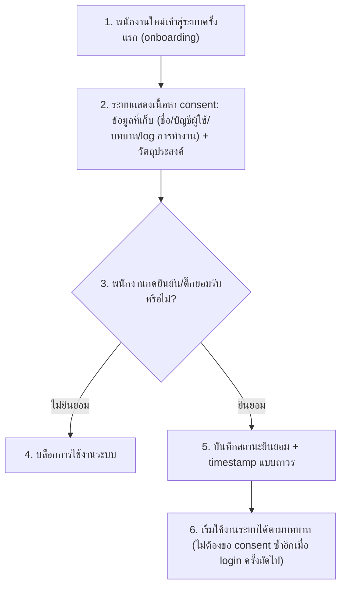

# User Journey — ขอความยินยอม (Consent) ตาม PDPA จากพนักงาน

**อ้างอิง Requirement:** [[../../01-requirements/01-spec/20260802-004-pdpa-consent|20260802-004]]
**วันที่:** 2026-08-15
**สถานะ:** ร่าง (Draft)

## Diagram

## คำอธิบายตามลำดับ

1. พนักงาน (พนักงานเสิร์ฟ, บาริสต้า, หรือผู้จัดการร้าน) เข้าสู่ระบบครั้งแรกตอน onboarding
2. ระบบแสดงเนื้อหา consent แบบง่าย ระบุข้อมูลที่เก็บ (ชื่อ, ข้อมูลบัญชีผู้ใช้, บทบาท, การบันทึก log การทำงาน) และวัตถุประสงค์ (การบริหารจัดการร้านและตรวจสอบย้อนหลัง)
3. พนักงานต้องกดยืนยัน/ติ๊กยอมรับก่อนจึงจะใช้งานระบบต่อได้
4. ถ้าไม่กดยินยอม ระบบบล็อกการใช้งานทั้งหมด เพราะเป็นเงื่อนไขจำเป็นขั้นต่ำ
5. ถ้ายินยอม ระบบบันทึกสถานะการยินยอมพร้อม timestamp ต่อพนักงานคนนั้นแบบถาวร
6. พนักงานเริ่มใช้งานระบบได้ตามบทบาทของตน และไม่ต้องขอ consent ซ้ำอีกในการ login ครั้งถัดไป

## Mapping กลับไป Requirement

| ขั้นตอนใน Diagram | อ้างอิงใน Spec |
|---|---|
| 1 | ความต้องการ (Requirement): "พนักงานทุกคน ... ต้องผ่านขั้นตอนขอความยินยอม (consent) ครั้งเดียวตอน onboarding ... ก่อนเริ่มใช้งานระบบ" |
| 2 | Scope (In scope): "แสดงเนื้อหา consent แบบง่าย ระบุข้อมูลที่เก็บ ... และวัตถุประสงค์" |
| 3–4 | Business Rules: "พนักงานทุกคนต้องยินยอมก่อนจึงจะใช้งานระบบได้ครั้งแรก เป็นเงื่อนไขบังคับ (mandatory gate) ไม่ใช่ optional" |
| 5 | Business Rules: "บันทึกสถานะการยินยอมพร้อม timestamp ต่อพนักงานแต่ละคน เก็บเป็นข้อมูลถาวร" |
| 6 | Scope (Out of scope): "การขอ consent ซ้ำเป็นระยะ (ทำครั้งเดียวตอน onboarding พอ ไม่ต้องขอซ้ำทุกครั้งที่ login)" |

## เอกสารที่เกี่ยวข้อง

- [[../../01-requirements/01-spec/20260802-004-pdpa-consent|spec ต้นทาง]]
- [[../02-technical/index|02-technical]]
