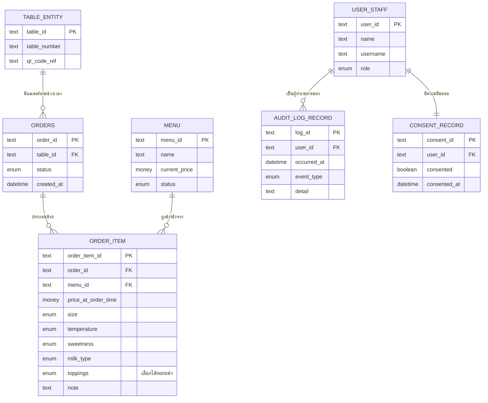

# Database Schema (Conceptual)

**วันที่จัดทำ/อัปเดตล่าสุด:** 2026-08-23
**สถานะ:** ร่าง (Draft)

> เอกสารนี้เป็นแบบจำลองข้อมูลเชิงแนวคิด (Conceptual Data Model) **ยังไม่ผูกมัดกับฐานข้อมูล เทคโนโลยี หรือชนิดข้อมูลของ DBMS ใด ๆ** เป็นการขยายรายละเอียดต่อจากหัวข้อ "แบบจำลองข้อมูลเชิงแนวคิด" ใน [[high-level-architecture|high-level-architecture.md]] การเลือกฐานข้อมูลจริงและ schema เชิงเทคนิค (ชนิดข้อมูลจริง, index, constraint) จะถูกจัดทำแยกต่างหากเมื่อมีการตัดสินใจเรื่อง stack แล้ว

## 1. ภาพรวม (Overview)

เอกสารนี้ครอบคลุมแบบจำลองข้อมูลของโดเมนร้านกาแฟหน้าร้านเดียว (single-branch) ทั้ง 4 requirement ที่มีอยู่ในปัจจุบัน ได้แก่ ระบบสั่งกาแฟจากโต๊ะด้วยการสแกน QR Code ([[../../01-requirements/01-spec/20260802-001-table-qr-ordering|20260802-001]]), หน้า Dashboard ดูยอดขาย ([[../../01-requirements/01-spec/20260802-002-sales-dashboard|20260802-002]]), ระบบบันทึก Log/Audit Trail ([[../../01-requirements/01-spec/20260802-003-audit-log|20260802-003]]) และการขอความยินยอมตาม PDPA จากพนักงาน ([[../../01-requirements/01-spec/20260802-004-pdpa-consent|20260802-004]]) ใช้แนวทางการแตกเอนทิตีแบบ **แตกละเอียดตามหลัก 1 fact ต่อเอนทิตี (normalized เชิงแนวคิด)** เป็นหลัก โดยมีข้อยกเว้นที่ตั้งใจ 1 จุด คือตัวเลือกเสริมของ "รายการสินค้าในออเดอร์" (ขนาด, ร้อน/เย็น, ความหวาน, ชนิดนม, ท็อปปิ้ง/เพิ่มช็อต, หมายเหตุ) ซึ่งฝังเป็น attribute อยู่ในเอนทิตีเดียวกันแทนการแยกเป็นเอนทิตีย่อย เพราะชุดตัวเลือกนี้ตายตัวตาม spec ปัจจุบันและผู้ใช้ยืนยันให้ทำแบบนี้โดยเจตนา รายชื่อเอนทิตีทั้งหมด (ออเดอร์, รายการสินค้าในออเดอร์, โต๊ะ, เมนู, ผู้ใช้/พนักงาน, บันทึกเหตุการณ์, ความยินยอม) สืบทอดมาจากหัวข้อ 6 ของ [[high-level-architecture|high-level-architecture.md]] แล้วขยายรายละเอียด attribute ต่อในเอกสารนี้

## 2. ER Diagram

> หมายเหตุ: ชื่อเอนทิตี `TABLE_ENTITY` ใช้แทนคำว่า "โต๊ะ" เพื่อหลีกเลี่ยงการชนกับคำสงวนของ syntax ไดอะแกรม ไม่ใช่การตั้งชื่อ table จริงในฐานข้อมูล

## 3. รายละเอียดแต่ละเอนทิตี (Entity Details)

### 3.1 ออเดอร์

คำสั่งซื้อ 1 รายการที่ลูกค้ายืนยันจากโต๊ะหนึ่ง ๆ มีสถานะไหลตามลำดับตลอด flow การสั่ง-ทำ-เสิร์ฟ

| Attribute | ชนิดข้อมูลเชิงแนวคิด | บังคับ/ไม่บังคับ | คำอธิบาย | ข้อจำกัดเชิงธุรกิจ |
|---|---|---|---|---|
| รหัสออเดอร์ | ข้อความ (รหัสอ้างอิง) | บังคับ | ตัวระบุเฉพาะของออเดอร์ 1 รายการ | ต้องไม่ซ้ำกันในระบบ |
| โต๊ะที่สั่ง | ข้อความ (อ้างอิงโต๊ะ) | บังคับ | โต๊ะที่ออเดอร์นี้ผูกอยู่ | ต้องอ้างอิงโต๊ะที่มีอยู่จริง |
| สถานะออเดอร์ | ค่าเลือกจากรายการ (รับออเดอร์แล้ว / กำลังทำ / เสร็จแล้ว / เสิร์ฟแล้ว) | บังคับ | สถานะปัจจุบันของออเดอร์ ไหลตามลำดับที่กำหนด | ต้องไหลตามลำดับ รับออเดอร์แล้ว -> กำลังทำ -> เสร็จแล้ว -> เสิร์ฟแล้ว เท่านั้น (business rule ของ 20260802-001) |
| เวลาที่สั่ง | วันที่/เวลา | บังคับ | เวลาที่ลูกค้ายืนยันสั่งออเดอร์นี้ | ใช้เป็นฐานคำนวณช่วงเวลา preset ("วันนี้"/"สัปดาห์นี้"/"เดือนนี้") ของ sales dashboard |

**ความสัมพันธ์กับเอนทิตีอื่น:** อยู่ภายใต้โต๊ะ 1 รายการ (โต๊ะ 1 : ออเดอร์ N), ประกอบด้วยรายการสินค้าในออเดอร์ได้หลายรายการ (ออเดอร์ 1 : รายการสินค้าในออเดอร์ N), เป็นแหล่งเหตุการณ์ให้บันทึกเหตุการณ์หลายรายการ (สร้างออเดอร์/เปลี่ยนสถานะ) ผ่านการอ้างอิงใน attribute "รายละเอียด" ของบันทึกเหตุการณ์

**อ้างอิง:** [[../../01-requirements/01-spec/20260802-001-table-qr-ordering|20260802-001]], [[../../01-requirements/01-spec/20260802-002-sales-dashboard|20260802-002]] (ใช้ข้อมูลออเดอร์คำนวณยอดขาย), [[../../01-requirements/01-spec/20260802-003-audit-log|20260802-003]] (เหตุการณ์สร้าง/เปลี่ยนสถานะออเดอร์ต้องถูกบันทึก log)

### 3.2 รายการสินค้าในออเดอร์

รายการเมนู 1 ชิ้นในออเดอร์หนึ่ง ๆ พร้อมตัวเลือกเสริมทั้งหมดที่ลูกค้าปรับ ณ ตอนสั่ง (ฝังตัวเลือกเสริมเป็น attribute เดียวกันตามการตัดสินใจของผู้ใช้ ไม่แยกเป็นเอนทิตีย่อย)

| Attribute | ชนิดข้อมูลเชิงแนวคิด | บังคับ/ไม่บังคับ | คำอธิบาย | ข้อจำกัดเชิงธุรกิจ |
|---|---|---|---|---|
| รหัสรายการสินค้าในออเดอร์ | ข้อความ (รหัสอ้างอิง) | บังคับ | ตัวระบุเฉพาะของรายการสินค้า 1 ชิ้น | ต้องไม่ซ้ำกันในระบบ |
| ออเดอร์ที่เป็นเจ้าของ | ข้อความ (อ้างอิงออเดอร์) | บังคับ | ออเดอร์ที่รายการนี้เป็นส่วนหนึ่งอยู่ | ต้องอ้างอิงออเดอร์ที่มีอยู่จริง |
| เมนูที่สั่ง | ข้อความ (อ้างอิงเมนู) | บังคับ | เมนูที่ถูกเลือกสำหรับรายการนี้ | ต้องอ้างอิงเมนูที่มีอยู่จริง |
| ราคา ณ ขณะสั่ง (price snapshot) | จำนวนเงิน | บังคับ | ราคาของเมนูรายการนี้ ณ เวลาที่สั่ง คัดลอกจากราคาปัจจุบันของเมนูตอนนั้น | ต้องไม่เปลี่ยนแปลงย้อนหลังแม้ราคาปัจจุบันในเมนูจะเปลี่ยนไปในอนาคต เพื่อให้ยอดขายในอดีตแม่นยำ (ตัดสินใจของ user เพื่อรองรับ 20260802-002) |
| ขนาด | ค่าเลือกจากรายการ (S / M / L) | บังคับ | ขนาดเครื่องดื่ม/เมนูที่เลือก | เป็น 1 ใน "ตัวเลือกเสริมครบทุกมิติ" ตาม scope ของ 20260802-001 |
| ร้อน/เย็น | ค่าเลือกจากรายการ (ร้อน / เย็น) | บังคับ | ประเภทอุณหภูมิของเครื่องดื่มที่เลือก | เป็น 1 ใน "ตัวเลือกเสริมครบทุกมิติ" ตาม scope ของ 20260802-001 |
| ระดับความหวาน | ค่าเลือกจากรายการ | บังคับ | ระดับความหวานที่เลือก | เป็น 1 ใน "ตัวเลือกเสริมครบทุกมิติ" ตาม scope ของ 20260802-001 |
| ชนิดนม | ค่าเลือกจากรายการ | บังคับ | ชนิดนมที่เลือก | เป็น 1 ใน "ตัวเลือกเสริมครบทุกมิติ" ตาม scope ของ 20260802-001 |
| ท็อปปิ้ง/เพิ่มช็อต | ค่าเลือกจากรายการ (เลือกได้หลายค่า) | ไม่บังคับ | รายการท็อปปิ้ง/เพิ่มช็อตที่เลือกเพิ่ม (เลือกได้ 0 รายการขึ้นไป) | เป็น 1 ใน "ตัวเลือกเสริมครบทุกมิติ" ตาม scope ของ 20260802-001 |
| หมายเหตุ | ข้อความ (free text) | ไม่บังคับ | หมายเหตุพิเศษที่ลูกค้าพิมพ์เพิ่มเติม | ระบุใน scope ของ 20260802-001 ว่าเป็น "ช่องหมายเหตุพิเศษแบบ free text" |

**ความสัมพันธ์กับเอนทิตีอื่น:** เป็นส่วนหนึ่งของออเดอร์ 1 รายการ (ออเดอร์ 1 : รายการสินค้าในออเดอร์ N), อ้างอิงเมนู 1 รายการ (เมนู 1 : รายการสินค้าในออเดอร์ N)

**อ้างอิง:** [[../../01-requirements/01-spec/20260802-001-table-qr-ordering|20260802-001]], [[../../01-requirements/01-spec/20260802-002-sales-dashboard|20260802-002]] (ราคา ณ ขณะสั่งใช้คำนวณยอดขายรวม)

### 3.3 โต๊ะ

จุดบริการที่ลูกค้านั่ง ผูกกับ QR code เฉพาะของตนเอง เป็นจุดเริ่มต้นของการสั่งอาหาร

| Attribute | ชนิดข้อมูลเชิงแนวคิด | บังคับ/ไม่บังคับ | คำอธิบาย | ข้อจำกัดเชิงธุรกิจ |
|---|---|---|---|---|
| รหัสโต๊ะ | ข้อความ (รหัสอ้างอิง) | บังคับ | ตัวระบุเฉพาะของโต๊ะ | ต้องไม่ซ้ำกันในระบบ |
| หมายเลข/ชื่อโต๊ะ | ข้อความ | บังคับ | หมายเลขหรือชื่อโต๊ะที่ใช้แสดงผลให้พนักงาน/ลูกค้าเห็น | ต้องไม่ซ้ำกันในระบบ |
| รหัสอ้างอิง QR code ประจำโต๊ะ | ข้อความ | บังคับ | ค่าอ้างอิงที่ผูกกับ QR code เฉพาะของโต๊ะนั้น ใช้เปิดหน้าสั่งอาหารของโต๊ะนี้เมื่อสแกน | ต้องไม่ซ้ำกันในระบบ (โต๊ะ 1 ตัวมี QR code เฉพาะของตนเอง 1 ต่อ 1) |

**ความสัมพันธ์กับเอนทิตีอื่น:** มีออเดอร์ได้หลายรายการตามช่วงเวลา (โต๊ะ 1 : ออเดอร์ N)

**อ้างอิง:** [[../../01-requirements/01-spec/20260802-001-table-qr-ordering|20260802-001]]

### 3.4 เมนู

รายการสินค้า (เครื่องดื่ม/อาหาร) ที่ร้านเสนอขาย มีสถานะเปิด/ปิดชั่วคราวแบบ manual toggle

| Attribute | ชนิดข้อมูลเชิงแนวคิด | บังคับ/ไม่บังคับ | คำอธิบาย | ข้อจำกัดเชิงธุรกิจ |
|---|---|---|---|---|
| รหัสเมนู | ข้อความ (รหัสอ้างอิง) | บังคับ | ตัวระบุเฉพาะของเมนู 1 รายการ | ต้องไม่ซ้ำกันในระบบ |
| ชื่อเมนู | ข้อความ | บังคับ | ชื่อรายการเมนูที่แสดงให้ลูกค้าเลือก | - |
| ราคาปัจจุบัน | จำนวนเงิน | บังคับ | ราคาขายปัจจุบันของเมนูนี้ | เปลี่ยนแปลงได้ตามการตั้งราคาของร้าน แต่การเปลี่ยนแปลงจะไม่กระทบราคา ณ ขณะสั่งที่บันทึกไว้แล้วในรายการสินค้าในออเดอร์เดิม (ตัดสินใจของ user) |
| สถานะเปิด/ปิด | ค่าเลือกจากรายการ (เปิดขาย / ปิดชั่วคราว) | บังคับ | สถานะที่ผู้จัดการร้านหรือบาริสต้าสามารถสับเปลี่ยนได้เองแบบ manual เมื่อสินค้าหมด | ไม่มีการตัดสต็อกอัตโนมัติผูกกับสถานะนี้ (out of scope ของ 20260802-001); เมื่อสถานะเป็น "ปิดชั่วคราว" ต้องแสดงสถานะ "หมด" ให้ลูกค้าเห็นทันทีที่หน้าสั่งอาหาร |

**ความสัมพันธ์กับเอนทิตีอื่น:** ถูกอ้างอิงจากรายการสินค้าในออเดอร์ได้หลายรายการ (เมนู 1 : รายการสินค้าในออเดอร์ N)

**อ้างอิง:** [[../../01-requirements/01-spec/20260802-001-table-qr-ordering|20260802-001]]

### 3.5 ผู้ใช้/พนักงาน

บัญชีของพนักงานในระบบ (ลูกค้าไม่มีบัญชีและไม่ต้อง login ตาม spec 20260802-001 และ 20260802-004) แต่ละบัญชีมีบทบาทกำกับสิทธิ์การใช้งาน

| Attribute | ชนิดข้อมูลเชิงแนวคิด | บังคับ/ไม่บังคับ | คำอธิบาย | ข้อจำกัดเชิงธุรกิจ |
|---|---|---|---|---|
| รหัสผู้ใช้ | ข้อความ (รหัสอ้างอิง) | บังคับ | ตัวระบุเฉพาะของบัญชีผู้ใช้ | ต้องไม่ซ้ำกันในระบบ |
| ชื่อ | ข้อความ | บังคับ | ชื่อของพนักงานเจ้าของบัญชี | ระบุไว้ใน scope ของ 20260802-004 ว่าเป็นข้อมูลที่ต้องแจ้งในเนื้อหา consent |
| ข้อมูลบัญชีผู้ใช้ | ข้อความ | บังคับ | ข้อมูลระบุตัวบัญชีผู้ใช้ (เช่น ชื่อผู้ใช้เชิงแนวคิด) | ต้องไม่ซ้ำกันในระบบ; ระบุไว้ใน scope ของ 20260802-004 ว่าเป็นข้อมูลที่ต้องแจ้งในเนื้อหา consent |
| บทบาท | ค่าเลือกจากรายการ (พนักงานเสิร์ฟ / บาริสต้า / ผู้บริหารร้าน (เจ้าของร้าน/ผู้จัดการร้าน)) | บังคับ | บทบาทที่กำกับสิทธิ์การเข้าถึงฟังก์ชันต่าง ๆ ในระบบ 1 บัญชีมี 1 บทบาท | บทบาท "ผู้บริหารร้าน" และ "บาริสต้า" มีสิทธิ์เปิด/ปิดเมนู (20260802-001); เฉพาะ "ผู้บริหารร้าน" มีสิทธิ์เข้า sales dashboard และหน้าดู audit log (20260802-002, 20260802-003); ทุกบทบาทต้องยินยอม PDPA ก่อนใช้งาน (20260802-004) — บทบาท "ผู้จัดการร้าน" และ "เจ้าของร้าน/แอดมิน" ถูกรวมเป็นบทบาทเดียวตามการตัดสินใจล่าสุดที่สะท้อนไว้ใน [[high-level-architecture|high-level-architecture.md]] หัวข้อ 2 และ 6 |

**ความสัมพันธ์กับเอนทิตีอื่น:** เป็นผู้ทำรายการของบันทึกเหตุการณ์ได้หลายรายการ (ผู้ใช้/พนักงาน 1 : บันทึกเหตุการณ์ N), มีความยินยอม 1 รายการต่อ 1 บัญชีแบบหนึ่งต่อหนึ่ง (ผู้ใช้/พนักงาน 1 : ความยินยอม 1)

**อ้างอิง:** [[../../01-requirements/01-spec/20260802-001-table-qr-ordering|20260802-001]], [[../../01-requirements/01-spec/20260802-002-sales-dashboard|20260802-002]], [[../../01-requirements/01-spec/20260802-003-audit-log|20260802-003]], [[../../01-requirements/01-spec/20260802-004-pdpa-consent|20260802-004]]

### 3.6 บันทึกเหตุการณ์ (Audit Log Record)

เหตุการณ์สำคัญ 1 รายการที่เกิดขึ้นในระบบ เพื่อการตรวจสอบย้อนหลัง

| Attribute | ชนิดข้อมูลเชิงแนวคิด | บังคับ/ไม่บังคับ | คำอธิบาย | ข้อจำกัดเชิงธุรกิจ |
|---|---|---|---|---|
| รหัส log record | ข้อความ (รหัสอ้างอิง) | บังคับ | ตัวระบุเฉพาะของ log record 1 รายการ | ต้องไม่ซ้ำกันในระบบ |
| เวลาที่เกิดเหตุการณ์ | วันที่/เวลา | บังคับ | timestamp ของเหตุการณ์ที่เกิดขึ้น | ใช้เป็นฐานคำนวณอายุของ log เพื่อลบอัตโนมัติเมื่อเกิน 90 วัน (20260802-003) |
| ผู้ทำรายการ | ข้อความ (อ้างอิงผู้ใช้/พนักงาน) | บังคับ | บัญชีผู้ใช้ที่เป็นผู้ทำรายการที่ก่อให้เกิดเหตุการณ์นี้ | ต้องอ้างอิงผู้ใช้/พนักงานที่มีอยู่จริง |
| ประเภทเหตุการณ์ | ค่าเลือกจากรายการ (สร้างออเดอร์ใหม่ / เปลี่ยนสถานะออเดอร์ / เปิดเมนู / ปิดเมนู / เข้าถึง sales dashboard) | บังคับ | หมวดของเหตุการณ์ที่เกิดขึ้น | ครอบคลุมเฉพาะ application-level business event ตาม scope ของ 20260802-003 ไม่รวม infrastructure/server log |
| รายละเอียด | ข้อความ | บังคับ | ข้อมูลประกอบเหตุการณ์ (เช่น รหัสออเดอร์ที่เกี่ยวข้อง, เมนูที่ถูกปิด) | ต้องระบุรายละเอียดที่เกี่ยวข้องกับเหตุการณ์นั้นเสมอ (business rule ของ 20260802-003) |

**ความสัมพันธ์กับเอนทิตีอื่น:** อ้างอิงผู้ใช้/พนักงาน 1 คนเป็นผู้ทำรายการ (ผู้ใช้/พนักงาน 1 : บันทึกเหตุการณ์ N), มีอายุจำกัด 90 วันก่อนถูกลบอัตโนมัติ (ดูหัวข้อ 4)

**อ้างอิง:** [[../../01-requirements/01-spec/20260802-003-audit-log|20260802-003]]

### 3.7 ความยินยอม (Consent Record)

สถานะยินยอม PDPA ของพนักงาน 1 คน บันทึกครั้งเดียวตอน onboarding และเก็บแบบถาวร

| Attribute | ชนิดข้อมูลเชิงแนวคิด | บังคับ/ไม่บังคับ | คำอธิบาย | ข้อจำกัดเชิงธุรกิจ |
|---|---|---|---|---|
| รหัสความยินยอม | ข้อความ (รหัสอ้างอิง) | บังคับ | ตัวระบุเฉพาะของ consent record 1 รายการ | ต้องไม่ซ้ำกันในระบบ |
| ผู้ใช้/พนักงานที่ยินยอม | ข้อความ (อ้างอิงผู้ใช้/พนักงาน) | บังคับ | บัญชีผู้ใช้ที่ consent record นี้ผูกอยู่ | ต้องอ้างอิงผู้ใช้/พนักงานที่มีอยู่จริง และมีได้เพียง 1 รายการต่อ 1 บัญชี (หนึ่งต่อหนึ่ง) |
| สถานะยินยอม | ค่าจริง/เท็จ (ยินยอม / ไม่ยินยอม) | บังคับ | ผลการกดยืนยัน/ติ๊กยอมรับของพนักงาน | หากเป็น "ไม่ยินยอม" ต้องบล็อกการใช้งานระบบทั้งหมดของพนักงานคนนั้น (mandatory gate ตาม business rule ของ 20260802-004) |
| เวลาที่ยินยอม | วันที่/เวลา | บังคับ | timestamp ของการกดยืนยัน/ติ๊กยอมรับ | บันทึกครั้งเดียวตอน onboarding ไม่ต้องขอซ้ำทุกครั้งที่ login (20260802-004); เก็บแบบถาวร ไม่ผูกกับนโยบาย retention 90 วันของ audit log |

**ความสัมพันธ์กับเอนทิตีอื่น:** ผูกกับผู้ใช้/พนักงาน 1 คนแบบหนึ่งต่อหนึ่ง (ผู้ใช้/พนักงาน 1 : ความยินยอม 1)

**อ้างอิง:** [[../../01-requirements/01-spec/20260802-004-pdpa-consent|20260802-004]]

## 4. กฎเชิงธุรกิจที่กระทบข้อมูล (Data-Related Business Rules)

- บันทึกเหตุการณ์ (audit log record) ที่มีอายุเกิน 90 วัน (นับจาก "เวลาที่เกิดเหตุการณ์") ต้องถูกลบออกจากระบบโดยอัตโนมัติ ตามหลัก data minimization ([[../../01-requirements/01-spec/20260802-003-audit-log|20260802-003]])
- ความยินยอม (consent record) เก็บแบบถาวร ไม่มีวันหมดอายุ และไม่ผูกกับนโยบาย retention 90 วันของบันทึกเหตุการณ์ แม้ทั้งคู่จะเป็นข้อมูลเชิงตรวจสอบย้อนหลัง ([[../../01-requirements/01-spec/20260802-004-pdpa-consent|20260802-004]])
- ราคา ณ ขณะสั่งในรายการสินค้าในออเดอร์ต้องเป็นค่าที่คัดลอกมาตอนสั่ง (price snapshot) และต้องไม่เปลี่ยนแปลงย้อนหลังตามราคาปัจจุบันในเมนูที่อาจเปลี่ยนไปในอนาคต เพื่อให้การคำนวณยอดขายรวมของ sales dashboard ในอดีตแม่นยำเสมอ (ตัดสินใจของ user เพื่อรองรับ [[../../01-requirements/01-spec/20260802-002-sales-dashboard|20260802-002]])
- เมนูที่มีสถานะ "ปิดชั่วคราว" ต้องแสดงสถานะ "หมด" ให้ลูกค้าเห็นทันทีที่หน้าสั่งอาหาร ไม่มีการตัดสต็อกอัตโนมัติเกี่ยวข้องกับสถานะนี้ ([[../../01-requirements/01-spec/20260802-001-table-qr-ordering|20260802-001]])
- สถานะออเดอร์ต้องไหลตามลำดับ "รับออเดอร์แล้ว -> กำลังทำ -> เสร็จแล้ว -> เสิร์ฟแล้ว" เท่านั้น และออเดอร์ที่ลูกค้ายืนยันแล้วต้องเข้าคิวบาริสต้าโดยตรงทันที ไม่ผ่านพนักงานเสิร์ฟกดรับก่อน ([[../../01-requirements/01-spec/20260802-001-table-qr-ordering|20260802-001]])
- ทุกบันทึกเหตุการณ์ต้องมีครบทั้ง timestamp, ผู้ทำรายการ, ประเภทเหตุการณ์ และรายละเอียดที่เกี่ยวข้องเสมอ ห้ามขาดฟิลด์ใดฟิลด์หนึ่ง ([[../../01-requirements/01-spec/20260802-003-audit-log|20260802-003]])
- พนักงานที่มีสถานะยินยอมเป็น "ไม่ยินยอม" หรือยังไม่มี consent record ต้องถูกบล็อกจากการใช้งานองค์ประกอบอื่นใดในระบบทั้งหมด ([[../../01-requirements/01-spec/20260802-004-pdpa-consent|20260802-004]])
- เฉพาะบทบาท "ผู้บริหารร้าน" (เจ้าของร้าน/ผู้จัดการร้าน — รวมเป็นบทบาทเดียวตาม [[high-level-architecture|high-level-architecture.md]]) เท่านั้นที่มีสิทธิ์เข้าถึงข้อมูลของ sales dashboard และหน้าดู audit log ย้อนหลัง บทบาทอื่น (พนักงานเสิร์ฟ, บาริสต้า) ไม่มีสิทธิ์เข้าถึง ([[../../01-requirements/01-spec/20260802-002-sales-dashboard|20260802-002]], [[../../01-requirements/01-spec/20260802-003-audit-log|20260802-003]])

## 5. ประเด็นที่ยังไม่ชัดเจน / รอการตัดสินใจ (Open Questions)

ไม่มีประเด็นค้างอยู่ในขณะนี้ ณ ตอนที่จัดทำเอกสารนี้ [[high-level-architecture|high-level-architecture.md]] ได้ปิดประเด็นบทบาท "ผู้จัดการร้าน"/"เจ้าของร้าน-แอดมิน" ไปแล้ว (รวมเป็นบทบาทเดียว "ผู้บริหารร้าน") จึงนำผลการตัดสินใจนั้นมาสะท้อนใน attribute "บทบาท" ของเอนทิตี "ผู้ใช้/พนักงาน" ข้างต้นโดยตรง ส่วนกลไกทางเทคนิคของการซิงก์ข้อมูลตอนเครือข่ายขัดข้อง ถูกตัดสินใจในระดับหลักการแล้วเช่นกัน (last-write-wins แบบง่าย ตามหัวข้อ 7 ของ high-level-architecture.md) แต่ไม่กระทบโครงสร้างเอนทิตี/attribute ในเอกสารนี้ จึงไม่ต้องเพิ่มอะไรในตาราง

หากมีประเด็นเชิงแบบจำลองข้อมูลใหม่เกิดขึ้นในรอบถัดไป ให้บันทึกเพิ่มในหัวข้อนี้ตามรูปแบบเดิม

## เอกสารที่เกี่ยวข้อง

- [[../../01-requirements/backlog|backlog.md]]
- [[../../01-requirements/feature-list|feature-list.md]]
- [[high-level-architecture|high-level-architecture.md]] (หัวข้อ 6: แบบจำลองข้อมูลเชิงแนวคิดระดับสรุป)
- [[index|02-technical]]
- [[../../03-testing/01-test-plan/test-plan|test-plan.md]]

## ประวัติการแก้ไข

- 2026-08-23: สร้างไฟล์ใหม่ทั้งหมด ครอบคลุมทั้ง 7 เอนทิตี (ออเดอร์, รายการสินค้าในออเดอร์, โต๊ะ, เมนู, ผู้ใช้/พนักงาน, บันทึกเหตุการณ์, ความยินยอม) ตามหัวข้อ 6 ของ high-level-architecture.md ครอบคลุม requirement 20260802-001 ถึง 20260802-004 ทั้งหมด ใช้แนวทางการแตกเอนทิตีแบบ normalized เชิงแนวคิด (1 fact ต่อเอนทิตี) ยกเว้นตัวเลือกเสริมของรายการสินค้าในออเดอร์ที่ฝังเป็น attribute เดียวกันตามการตัดสินใจของผู้ใช้ และเก็บราคา ณ ขณะสั่งแยกจากราคาปัจจุบันของเมนู (price snapshot) เพื่อความแม่นยำของยอดขายในอดีต
- 2026-08-23: แก้ไข attribute "บทบาท" ของเอนทิตี "ผู้ใช้/พนักงาน" (และข้อความอ้างอิงที่เกี่ยวข้องในหัวข้อ 4 และ 5) ให้ตรงกับ high-level-architecture.md เวอร์ชันล่าสุดที่รวมบทบาท "ผู้จัดการร้าน" กับ "เจ้าของร้าน/แอดมิน" เป็นบทบาทเดียว "ผู้บริหารร้าน" ไปแล้ว (ฉบับร่างแรกของไฟล์นี้อ้างอิง high-level-architecture.md เวอร์ชันเก่าที่ยังไม่ได้ merge บทบาทนี้ โดยไม่ได้ตั้งใจ) และปิด open question ที่เกี่ยวข้องทั้งสองข้อในหัวข้อ 5 เนื่องจากถูกตัดสินใจแล้วในเอกสารต้นทาง
