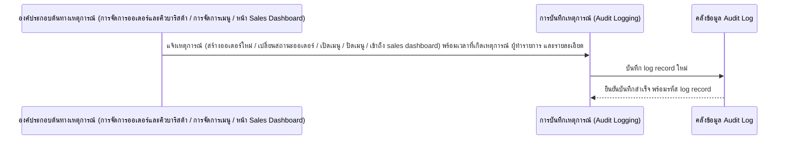
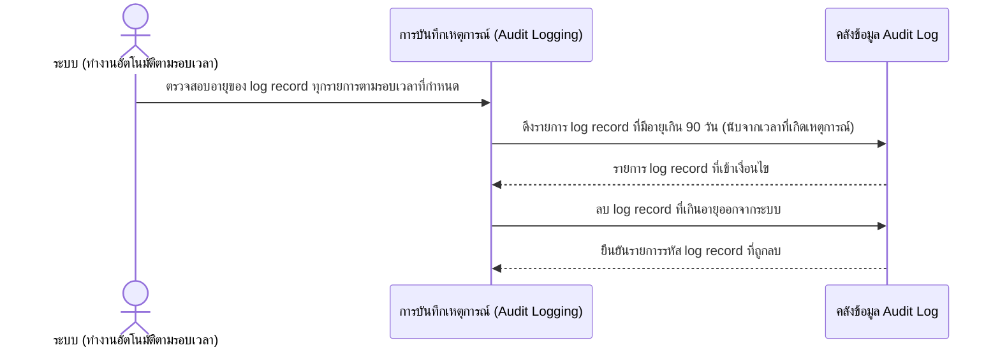
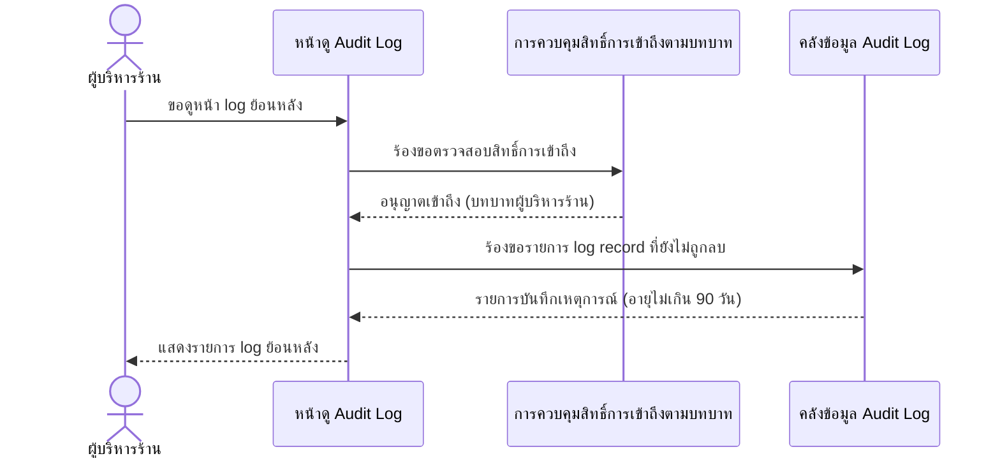
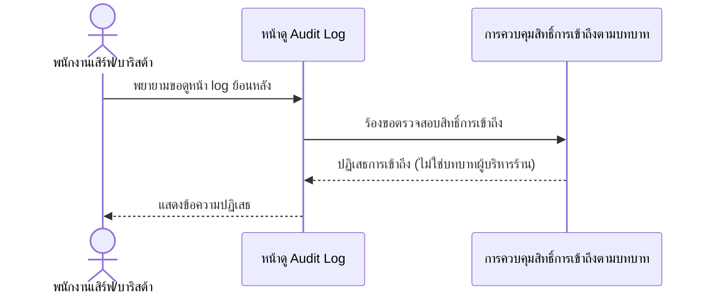

# Detailed Design — ระบบบันทึก Log (Audit Trail)

**อ้างอิง Requirement:** [[../../../01-requirements/01-spec/20260802-003-audit-log|20260802-003]]
**อ้างอิง User Journey:** [[../../01-prototypes/20260802-003-audit-log-journey|เปิด journey]]
**อ้างอิง API Spec:** [[../api-spec#2.6 บันทึกเหตุการณ์ (Audit Log Record)|บันทึกเหตุการณ์ (Audit Log Record)]]
**วันที่:** 2026-08-23
**สถานะ:** ร่าง (Draft)

> เอกสารนี้เป็นการออกแบบเชิงแนวคิด (Conceptual Detailed Design) **ยังไม่ผูกมัดกับเทคโนโลยี เฟรมเวิร์ก หรือ protocol ใด ๆ** การออกแบบ interaction เชิงเทคนิคจริงจะถูกจัดทำแยกต่างหากเมื่อมีการตัดสินใจเรื่อง stack แล้ว

## 1. ภาพรวม

ฟีเจอร์นี้บันทึกเหตุการณ์สำคัญที่เกิดขึ้นในระบบ (สร้างออเดอร์ใหม่, เปลี่ยนสถานะออเดอร์, เปิด/ปิดเมนูชั่วคราว, เข้าถึงหน้า Sales Dashboard) เป็น log record พร้อม timestamp, ผู้ทำรายการ, ประเภทเหตุการณ์ และรายละเอียดที่เกี่ยวข้องเสมอ log ที่มีอายุเกิน 90 วันต้องถูกลบออกจากระบบโดยอัตโนมัติตามหลัก data minimization และเฉพาะบทบาทผู้บริหารร้าน (เจ้าของร้าน/ผู้จัดการร้าน) เท่านั้นที่มีสิทธิ์เข้าถึงหน้าดู log ย้อนหลัง ฟีเจอร์นี้เป็น supporting feature ที่ดักจับเหตุการณ์จากฟีเจอร์อื่น (โดยเฉพาะ [[../../../01-requirements/01-spec/20260802-001-table-qr-ordering|20260802-001]] และ [[../../../01-requirements/01-spec/20260802-002-sales-dashboard|20260802-002]]) เพื่อความโปร่งใสและตรวจสอบย้อนหลังได้

## 2. Sequence Flow

### 2.1 กรณีปกติ (Happy Path): บันทึกเหตุการณ์เมื่อเกิด business event

**ลำดับขั้นตอนโดยละเอียด:**

| Step | ผู้กระทำ/องค์ประกอบ | การกระทำ | ข้อมูลที่เกี่ยวข้อง | การตรวจสอบ/กฎธุรกิจ (Validation) | กรณีผิดพลาดและผลลัพธ์ (ถ้ามี) |
|---|---|---|---|---|---|
| 1 | องค์ประกอบต้นทางเหตุการณ์ (การจัดการออเดอร์และคิวบาริสต้า / การจัดการเมนู / หน้า Sales Dashboard) | แจ้งเหตุการณ์ที่เกิดขึ้นจริงไปยังการบันทึกเหตุการณ์ | เวลาที่เกิดเหตุการณ์, ผู้ทำรายการ, ประเภทเหตุการณ์, รายละเอียด | ต้องมีเหตุการณ์ประเภทที่กำหนดไว้เกิดขึ้นจริง (precondition ของ operation "บันทึกเหตุการณ์" ใน api-spec.md) | - |
| 2 | การบันทึกเหตุการณ์ (Audit Logging) | บันทึก log record ลงคลังข้อมูล Audit Log | เอนทิตี "บันทึกเหตุการณ์" (เวลาที่เกิดเหตุการณ์, ผู้ทำรายการ, ประเภทเหตุการณ์, รายละเอียด) | ทุก log record ต้องมีครบทั้ง 4 ฟิลด์ ห้ามขาดฟิลด์ใดฟิลด์หนึ่ง; ครอบคลุมเฉพาะ application-level business event เท่านั้น ไม่รวม infrastructure/server log (business rule 20260802-003) | ไม่มี (เป็น operation ภายในที่ต้องสำเร็จเสมอเมื่อเหตุการณ์ต้นทางเกิดขึ้น ตาม api-spec.md) |

### 2.2 กรณีปกติ: ลบบันทึกเหตุการณ์อัตโนมัติเมื่อเกินอายุเก็บรักษา 90 วัน

**ลำดับขั้นตอนโดยละเอียด:**

| Step | ผู้กระทำ/องค์ประกอบ | การกระทำ | ข้อมูลที่เกี่ยวข้อง | การตรวจสอบ/กฎธุรกิจ (Validation) | กรณีผิดพลาดและผลลัพธ์ (ถ้ามี) |
|---|---|---|---|---|---|
| 1 | ระบบ / การบันทึกเหตุการณ์ | ตรวจสอบอายุของ log record แต่ละรายการเทียบกับ "เวลาที่เกิดเหตุการณ์" | เอนทิตี "บันทึกเหตุการณ์" (เวลาที่เกิดเหตุการณ์) | precondition: บันทึกเหตุการณ์นั้นมีอายุเกิน 90 วัน (operation "ลบบันทึกเหตุการณ์ที่เกินอายุเก็บรักษาอัตโนมัติ" ใน api-spec.md) | - |
| 2 | การบันทึกเหตุการณ์ / คลังข้อมูล Audit Log | ลบ log record ที่มีอายุเกิน 90 วันออกจากระบบโดยอัตโนมัติ | เอนทิตี "บันทึกเหตุการณ์" | ต้องลบอัตโนมัติตามหลัก data minimization เมื่ออายุเกิน 90 วัน ไม่มีการ export ก่อนลบในเฟสนี้ (business rule 20260802-003) | ไม่มี |

### 2.3 กรณีปกติ: ผู้บริหารร้านดู Audit Log ย้อนหลังสำเร็จ

**ลำดับขั้นตอนโดยละเอียด:**

| Step | ผู้กระทำ/องค์ประกอบ | การกระทำ | ข้อมูลที่เกี่ยวข้อง | การตรวจสอบ/กฎธุรกิจ (Validation) | กรณีผิดพลาดและผลลัพธ์ (ถ้ามี) |
|---|---|---|---|---|---|
| 1 | ผู้บริหารร้าน / หน้าดู Audit Log | ขอดูหน้า log ย้อนหลัง | เอนทิตี "ผู้ใช้/พนักงาน" (บทบาท) | เฉพาะบทบาทผู้บริหารร้านเท่านั้นที่เข้าถึงได้ (business rule 20260802-003) | ดูสถานการณ์ผิดพลาดใน scenario 2.4 |
| 2 | การควบคุมสิทธิ์การเข้าถึงตามบทบาท | ตรวจสอบบทบาทของผู้เรียกใช้ก่อนอนุญาตเข้าถึง | เอนทิตี "ผู้ใช้/พนักงาน" (บทบาท) | เฉพาะบทบาท "ผู้บริหารร้าน" เท่านั้นที่ผ่านการตรวจสอบ (business rule ของ operation "ตรวจสอบสิทธิ์การเข้าถึงตามบทบาท" ใน api-spec.md) | ถ้าไม่ใช่บทบาทผู้บริหารร้าน -> ปฏิเสธการเข้าถึง (ดู scenario 2.4) |
| 3 | หน้าดู Audit Log / คลังข้อมูล Audit Log | ดึงรายการ log record ที่ยังไม่ถูกลบมาแสดง | เอนทิตี "บันทึกเหตุการณ์" (log record ทั้งหมดที่ยังไม่เกิน 90 วัน) | แสดงเฉพาะ log record ที่ยังไม่ถูกลบ (อายุไม่เกิน 90 วัน) (business rule ของ operation "ดู Audit Log ย้อนหลัง" ใน api-spec.md) | - |

### 2.4 กรณีข้อผิดพลาด: บทบาทอื่นพยายามดู Audit Log ย้อนหลัง

**ลำดับขั้นตอนโดยละเอียด:**

| Step | ผู้กระทำ/องค์ประกอบ | การกระทำ | ข้อมูลที่เกี่ยวข้อง | การตรวจสอบ/กฎธุรกิจ (Validation) | กรณีผิดพลาดและผลลัพธ์ (ถ้ามี) |
|---|---|---|---|---|---|
| 1 | พนักงานเสิร์ฟ/บาริสต้า | พยายามขอดูหน้า log ย้อนหลัง | เอนทิตี "ผู้ใช้/พนักงาน" (บทบาท) | บทบาทอื่นนอกจากผู้บริหารร้านไม่มีสิทธิ์เข้าถึง (business rule 20260802-003) | - |
| 2 | การควบคุมสิทธิ์การเข้าถึงตามบทบาท | ตรวจสอบบทบาทของผู้เรียกใช้ | เอนทิตี "ผู้ใช้/พนักงาน" (บทบาท) | เฉพาะบทบาท "ผู้บริหารร้าน" เท่านั้นที่ผ่านการตรวจสอบ | ถ้าผู้เรียกไม่ใช่บทบาทผู้บริหารร้าน -> ปฏิเสธการเข้าถึง (business exception ของ operation "ดู Audit Log ย้อนหลัง" ใน api-spec.md) |

## 3. องค์ประกอบ/Operation ที่เกี่ยวข้อง

- **องค์ประกอบเชิงแนวคิด:** [[../high-level-architecture#4. องค์ประกอบเชิงแนวคิด (Conceptual Components)|high-level-architecture.md หัวข้อ 4]] — การบันทึกเหตุการณ์ (Audit Logging), การควบคุมสิทธิ์การเข้าถึงตามบทบาท, หน้าดู Audit Log, คลังข้อมูล Audit Log
- **Operation ที่เกี่ยวข้อง:** [[../api-spec#2.6 บันทึกเหตุการณ์ (Audit Log Record)|api-spec.md หัวข้อ 2.6 บันทึกเหตุการณ์]] (บันทึกเหตุการณ์, ดู Audit Log ย้อนหลัง, ลบบันทึกเหตุการณ์ที่เกินอายุเก็บรักษาอัตโนมัติ), [[../api-spec#2.5 ผู้ใช้/พนักงาน|2.5 ผู้ใช้/พนักงาน]] (ตรวจสอบสิทธิ์การเข้าถึงตามบทบาท)
- **เอนทิตีข้อมูลที่เกี่ยวข้อง:** [[../database-schema#3.6 บันทึกเหตุการณ์ (Audit Log Record)|database-schema.md 3.6 บันทึกเหตุการณ์]], [[../database-schema#3.5 ผู้ใช้/พนักงาน|3.5 ผู้ใช้/พนักงาน]]

## 4. ประเด็นที่ยังไม่ชัดเจน / รอการตัดสินใจ (Open Questions)

- api-spec.md บันทึกไว้ว่า operation "ดู Audit Log ย้อนหลัง" ยังไม่มีรายละเอียดตัวกรอง (เช่น filter ตามช่วงเวลา/ประเภทเหตุการณ์/ผู้ทำรายการ) เนื่องจาก spec 20260802-003 ปัจจุบันไม่ได้ระบุไว้ — scenario 2.3 ในเอกสารนี้จึงแสดงผลเป็นรายการ log ทั้งหมดที่ยังไม่ถูกลบเท่านั้น ยังไม่มี sequence ของการกรองผลลัพธ์ ต้องรอ requirement เพิ่มเติมก่อนจึงจะออกแบบ flow การกรองได้

## เอกสารที่เกี่ยวข้อง

- [[../../../01-requirements/01-spec/20260802-003-audit-log|spec ต้นทาง]]
- [[../high-level-architecture|high-level-architecture.md]]
- [[../database-schema|database-schema.md]]
- [[../api-spec|api-spec.md]]
- [[index|detailed-design]]

## ประวัติการแก้ไข

- 2026-08-23: สร้างไฟล์ใหม่ทั้งหมด ครอบคลุม 4 scenario (บันทึกเหตุการณ์เมื่อเกิด business event, ลบ log อัตโนมัติเมื่อเกิน 90 วัน, ผู้บริหารร้านดู log ย้อนหลังสำเร็จ, error กรณีบทบาทไม่มีสิทธิ์) ใช้ค่ามาตรฐานของ skill (sequence + validation/error handling ต่อ step) ไม่มีตารางการเปลี่ยนสถานะเอนทิตีตามที่ user ยืนยันสำหรับ feature นี้ อ้างอิง spec, journey และ api-spec operation ในหมวดบันทึกเหตุการณ์ทั้งหมด รวมทั้งบันทึก open question เรื่องตัวกรองของหน้าดู log ที่ยังไม่ชัดเจนใน spec
