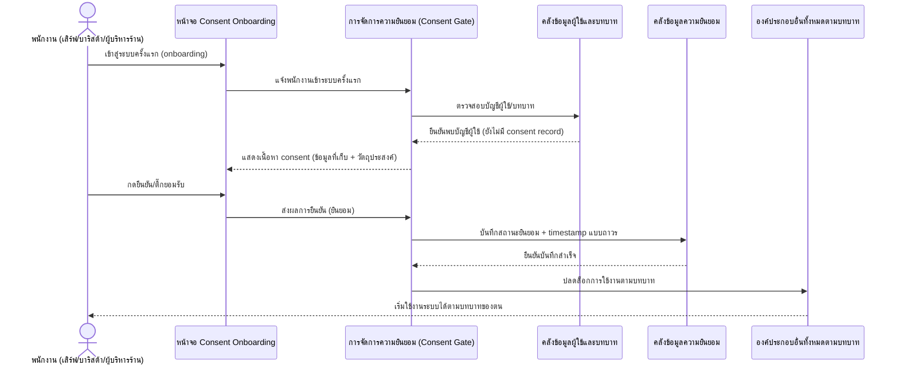
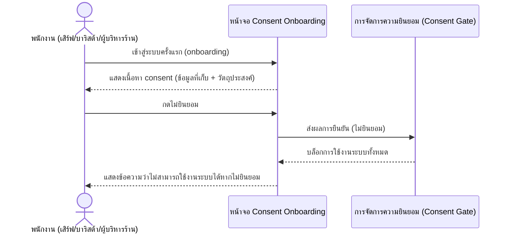
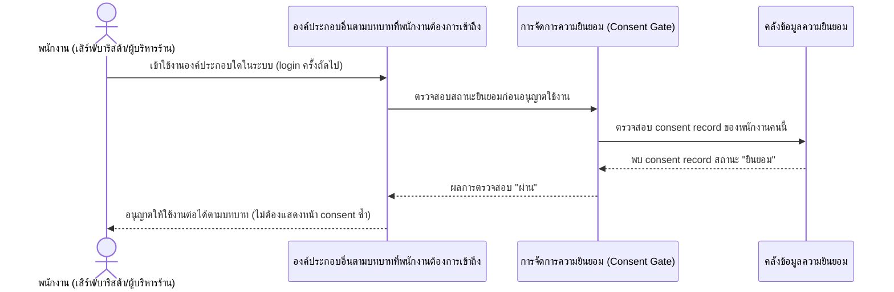

# Detailed Design — ขอความยินยอม (Consent) ตาม PDPA จากพนักงาน

**อ้างอิง Requirement:** [[../../../01-requirements/01-spec/20260802-004-pdpa-consent|20260802-004]]
**อ้างอิง User Journey:** [[../../01-prototypes/20260802-004-pdpa-consent-journey|เปิด journey]]
**อ้างอิง API Spec:** [[../api-spec#2.7 ความยินยอม (Consent Record)|ความยินยอม (Consent Record)]]
**วันที่:** 2026-08-23
**สถานะ:** ร่าง (Draft)

> เอกสารนี้เป็นการออกแบบเชิงแนวคิด (Conceptual Detailed Design) **ยังไม่ผูกมัดกับเทคโนโลยี เฟรมเวิร์ก หรือ protocol ใด ๆ** การออกแบบ interaction เชิงเทคนิคจริงจะถูกจัดทำแยกต่างหากเมื่อมีการตัดสินใจเรื่อง stack แล้ว

## 1. ภาพรวม

ฟีเจอร์นี้กำหนดให้พนักงานทุกคน (พนักงานเสิร์ฟ, บาริสต้า, ผู้บริหารร้าน) ต้องผ่านขั้นตอนขอความยินยอม (consent) ตาม PDPA ครั้งเดียวตอน onboarding ก่อนเริ่มใช้งานระบบได้ เนื้อหา consent ระบุสั้น ๆ ว่าระบบเก็บข้อมูลอะไรบ้าง (ชื่อ, ข้อมูลบัญชีผู้ใช้, บทบาท, การบันทึก log การทำงานตาม [[../../../01-requirements/01-spec/20260802-003-audit-log|20260802-003]]) และวัตถุประสงค์ในการเก็บ หากพนักงานไม่กดยินยอม ระบบต้องบล็อกการใช้งานทั้งหมดเพราะเป็นเงื่อนไขบังคับ (mandatory gate) เมื่อยินยอมแล้ว ระบบบันทึกสถานะพร้อม timestamp แบบถาวรและไม่ต้องขอซ้ำอีกในการ login ครั้งถัดไป

## 2. Sequence Flow

### 2.1 กรณีปกติ (Happy Path): พนักงานยินยอมสำเร็จตอน onboarding

**ลำดับขั้นตอนโดยละเอียด:**

| Step | ผู้กระทำ/องค์ประกอบ | การกระทำ | ข้อมูลที่เกี่ยวข้อง | การตรวจสอบ/กฎธุรกิจ (Validation) | กรณีผิดพลาดและผลลัพธ์ (ถ้ามี) |
|---|---|---|---|---|---|
| 1 | พนักงาน / หน้าจอ Consent Onboarding | เข้าสู่ระบบครั้งแรกตอน onboarding | เอนทิตี "ผู้ใช้/พนักงาน" | พนักงานทุกคนที่มีบัญชีผู้ใช้ในระบบต้องผ่านขั้นตอนนี้ (business rule 20260802-004) | - |
| 2 | การจัดการความยินยอม (Consent Gate) | ตรวจสอบบัญชีผู้ใช้/บทบาท และตรวจว่ายังไม่เคยมี consent record | เอนทิตี "ผู้ใช้/พนักงาน", "ความยินยอม" | precondition: พนักงานยังไม่มีบันทึกความยินยอมมาก่อน (operation "ขอความยินยอม PDPA ตอน onboarding" ใน api-spec.md) | ถ้าพนักงานเคยยินยอมแล้ว -> ไม่ต้องแสดงขั้นตอนนี้ซ้ำ (ดู scenario 2.3) |
| 3 | การจัดการความยินยอม (Consent Gate) | แสดงเนื้อหา consent แบบง่าย ระบุข้อมูลที่เก็บ (ชื่อ, ข้อมูลบัญชีผู้ใช้, บทบาท, log การทำงาน) และวัตถุประสงค์ | เอนทิตี "ผู้ใช้/พนักงาน" (ชื่อ, ข้อมูลบัญชีผู้ใช้, บทบาท) | เนื้อหา consent ต้องระบุข้อมูลที่เก็บและวัตถุประสงค์ครบตาม scope ของ 20260802-004 | - |
| 4 | พนักงาน | กดยืนยัน/ติ๊กยอมรับ | ผลการยืนยัน (ยินยอม) | พนักงานต้องกดยืนยันก่อนจึงจะใช้งานระบบต่อได้ (business rule 20260802-004) | ถ้าไม่ยินยอม -> ดู scenario 2.2 |
| 5 | การจัดการความยินยอม (Consent Gate) / คลังข้อมูลความยินยอม | บันทึกสถานะยินยอม + timestamp แบบถาวร | เอนทิตี "ความยินยอม" (สถานะยินยอม, เวลาที่ยินยอม) | บันทึกสถานะแบบถาวร ไม่ผูกกับนโยบาย retention 90 วันของ audit log; ขอ consent เพียงครั้งเดียวตอน onboarding (business rule 20260802-004) | - |
| 6 | การจัดการความยินยอม (Consent Gate) / องค์ประกอบอื่นทั้งหมดตามบทบาท | ปลดล็อกการใช้งานระบบตามบทบาทของพนักงาน | เอนทิตี "ผู้ใช้/พนักงาน" (บทบาท) | พนักงานเริ่มใช้งานระบบได้ตามบทบาทของตนทันทีหลังยินยอม | - |

### 2.2 กรณีข้อผิดพลาด: พนักงานไม่กดยินยอม

**ลำดับขั้นตอนโดยละเอียด:**

| Step | ผู้กระทำ/องค์ประกอบ | การกระทำ | ข้อมูลที่เกี่ยวข้อง | การตรวจสอบ/กฎธุรกิจ (Validation) | กรณีผิดพลาดและผลลัพธ์ (ถ้ามี) |
|---|---|---|---|---|---|
| 1 | พนักงาน | กดปุ่ม/ติ๊ก "ไม่ยินยอม" | ผลการยืนยัน (ไม่ยินยอม) | เป็นเงื่อนไขบังคับ (mandatory gate) ไม่ใช่ optional (business rule 20260802-004) | - |
| 2 | การจัดการความยินยอม (Consent Gate) | บล็อกการใช้งานระบบทั้งหมดของพนักงานคนนั้นทันที | เอนทิตี "ความยินยอม" (สถานะยินยอม = ไม่ยินยอม) | หากพนักงานไม่กดยินยอม จะไม่สามารถใช้งานระบบได้เพราะเป็นเงื่อนไขจำเป็นขั้นต่ำในการทำงาน (business rule 20260802-004) | ผลลัพธ์: บล็อกการใช้งานระบบทั้งหมด (ไม่มี business exception อื่นเพิ่มเติมนอกเหนือจากนี้ตาม spec ปัจจุบัน) |

### 2.3 กรณีปกติ: พนักงานที่เคยยินยอมแล้ว login ครั้งถัดไปโดยไม่ต้องขอ consent ซ้ำ

**ลำดับขั้นตอนโดยละเอียด:**

| Step | ผู้กระทำ/องค์ประกอบ | การกระทำ | ข้อมูลที่เกี่ยวข้อง | การตรวจสอบ/กฎธุรกิจ (Validation) | กรณีผิดพลาดและผลลัพธ์ (ถ้ามี) |
|---|---|---|---|---|---|
| 1 | พนักงาน | พยายามเข้าใช้งานองค์ประกอบใดในระบบ | เอนทิตี "ผู้ใช้/พนักงาน" | ทุกครั้งที่พนักงานเข้าถึงองค์ประกอบอื่นใดต้องผ่านการตรวจสอบนี้ก่อน (precondition ของ operation "ตรวจสอบสถานะยินยอมก่อนอนุญาตใช้งาน (Consent Gate)" ใน api-spec.md) | - |
| 2 | การจัดการความยินยอม (Consent Gate) | ตรวจสอบ consent record ของพนักงานคนนี้ | เอนทิตี "ความยินยอม" (สถานะยินยอม) | ขอ consent เพียงครั้งเดียวตอน onboarding ไม่ต้องขอซ้ำทุกครั้งที่ login (business rule 20260802-004); ถ้าพนักงานเคยยินยอมแล้ว ไม่ต้องแสดงขั้นตอนขอ consent ซ้ำ (business exception ของ operation "ขอความยินยอม PDPA ตอน onboarding" ใน api-spec.md) | ถ้าไม่พบ consent record หรือสถานะเป็น "ไม่ยินยอม" -> บล็อกการใช้งานทั้งหมด (business exception ของ operation "ตรวจสอบสถานะยินยอมก่อนอนุญาตใช้งาน (Consent Gate)" ใน api-spec.md) |
| 3 | การจัดการความยินยอม (Consent Gate) / องค์ประกอบอื่นตามบทบาท | อนุญาตให้พนักงานใช้งานต่อได้ทันที | ผลการตรวจสอบ "ผ่าน" | พนักงานเริ่มใช้งานระบบได้ตามบทบาทโดยไม่ต้องขอ consent ซ้ำ | - |

## 3. องค์ประกอบ/Operation ที่เกี่ยวข้อง

- **องค์ประกอบเชิงแนวคิด:** [[../high-level-architecture#4. องค์ประกอบเชิงแนวคิด (Conceptual Components)|high-level-architecture.md หัวข้อ 4]] — หน้าจอ Consent Onboarding, การจัดการความยินยอม (Consent Gate), คลังข้อมูลผู้ใช้และบทบาท, คลังข้อมูลความยินยอม
- **Operation ที่เกี่ยวข้อง:** [[../api-spec#2.7 ความยินยอม (Consent Record)|api-spec.md หัวข้อ 2.7 ความยินยอม]] (ขอความยินยอม PDPA ตอน onboarding, ตรวจสอบสถานะยินยอมก่อนอนุญาตใช้งาน (Consent Gate))
- **เอนทิตีข้อมูลที่เกี่ยวข้อง:** [[../database-schema#3.7 ความยินยอม (Consent Record)|database-schema.md 3.7 ความยินยอม]], [[../database-schema#3.5 ผู้ใช้/พนักงาน|3.5 ผู้ใช้/พนักงาน]]

## 4. ประเด็นที่ยังไม่ชัดเจน / รอการตัดสินใจ (Open Questions)

- api-spec.md บันทึกไว้ว่า spec ปัจจุบันไม่ได้ระบุรายละเอียด operation "ยืนยันตัวตนพนักงานก่อนเข้าใช้งานระบบ" (login/authentication เชิงแนวคิด) จึงยังไม่มี sequence ของขั้นตอน login ก่อนหน้า "เข้าสู่ระบบครั้งแรก (onboarding)" ใน scenario 2.1 ของเอกสารนี้ — ต้องรอ requirement เพิ่มเติมก่อนจึงจะออกแบบ flow การยืนยันตัวตนที่มาก่อน consent gate ได้แบบเต็มรูปแบบ

## เอกสารที่เกี่ยวข้อง

- [[../../../01-requirements/01-spec/20260802-004-pdpa-consent|spec ต้นทาง]]
- [[../high-level-architecture|high-level-architecture.md]]
- [[../database-schema|database-schema.md]]
- [[../api-spec|api-spec.md]]
- [[index|detailed-design]]

## ประวัติการแก้ไข

- 2026-08-23: สร้างไฟล์ใหม่ทั้งหมด ครอบคลุม 3 scenario (happy path พนักงานยินยอมสำเร็จตอน onboarding, error กรณีไม่ยินยอม, happy path login ครั้งถัดไปไม่ต้องขอ consent ซ้ำ) ใช้ค่ามาตรฐานของ skill (sequence + validation/error handling ต่อ step) ไม่มีตารางการเปลี่ยนสถานะเอนทิตีตามที่ user ยืนยันสำหรับ feature นี้ อ้างอิง spec, journey และ api-spec operation ในหมวดความยินยอมทั้งหมด รวมทั้งบันทึก open question เรื่อง operation ยืนยันตัวตนพนักงานที่ยังไม่มีรายละเอียดใน spec
