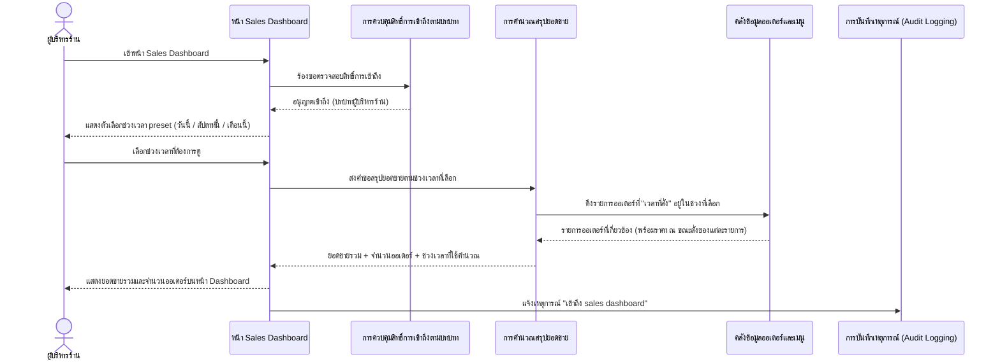
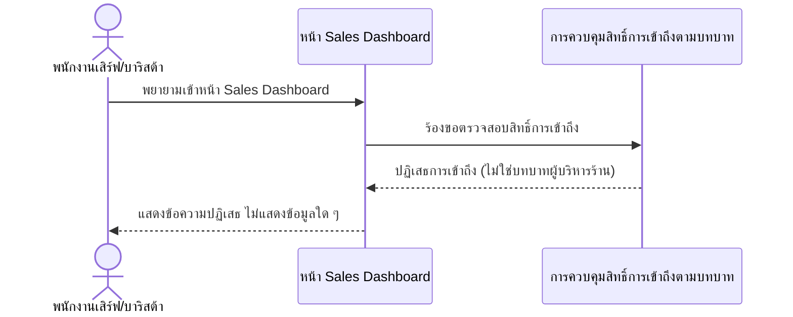

# Detailed Design — หน้า Dashboard ดูยอดขาย

**อ้างอิง Requirement:** [[../../../01-requirements/01-spec/20260802-002-sales-dashboard|20260802-002]]
**อ้างอิง User Journey:** [[../../01-prototypes/20260802-002-sales-dashboard-journey|เปิด journey]]
**อ้างอิง API Spec:** [[../api-spec#2.1 ออเดอร์|ดูสรุปยอดขายตามช่วงเวลา (preset)]]
**วันที่:** 2026-08-23
**สถานะ:** ร่าง (Draft)

> เอกสารนี้เป็นการออกแบบเชิงแนวคิด (Conceptual Detailed Design) **ยังไม่ผูกมัดกับเทคโนโลยี เฟรมเวิร์ก หรือ protocol ใด ๆ** การออกแบบ interaction เชิงเทคนิคจริงจะถูกจัดทำแยกต่างหากเมื่อมีการตัดสินใจเรื่อง stack แล้ว

## 1. ภาพรวม

ฟีเจอร์นี้ให้ผู้บริหารร้าน (เจ้าของร้าน/ผู้จัดการร้าน) ดูภาพรวมยอดขายรวม (จำนวนเงิน) และจำนวนออเดอร์ตามช่วงเวลาแบบ preset สำเร็จรูป ("วันนี้", "สัปดาห์นี้", "เดือนนี้") โดยข้อมูลคำนวณจากออเดอร์ที่เกิดขึ้นจริงในระบบสั่งกาแฟ ([[../../../01-requirements/01-spec/20260802-001-table-qr-ordering|20260802-001]]) หน้านี้จำกัดสิทธิ์การเข้าถึงเฉพาะบทบาทผู้บริหารร้านเท่านั้น บทบาทอื่น (พนักงานเสิร์ฟ, บาริสต้า) ไม่มีสิทธิ์เข้าถึงและต้องถูกปฏิเสธทันที การเข้าถึงหน้านี้แต่ละครั้งยังต้องกระตุ้นให้เกิดการบันทึกเหตุการณ์เพื่อการตรวจสอบย้อนหลัง (อ้างอิง [[audit-log|detailed design ของ 20260802-003]])

## 2. Sequence Flow

### 2.1 กรณีปกติ (Happy Path): ผู้บริหารร้านดูยอดขายสำเร็จ

**ลำดับขั้นตอนโดยละเอียด:**

| Step | ผู้กระทำ/องค์ประกอบ | การกระทำ | ข้อมูลที่เกี่ยวข้อง | การตรวจสอบ/กฎธุรกิจ (Validation) | กรณีผิดพลาดและผลลัพธ์ (ถ้ามี) |
|---|---|---|---|---|---|
| 1 | ผู้บริหารร้าน / หน้า Sales Dashboard | เข้าหน้า Sales Dashboard | เอนทิตี "ผู้ใช้/พนักงาน" (บทบาท) | หน้านี้จำกัดสิทธิ์เฉพาะบทบาทผู้บริหารร้าน (business rule 20260802-002) | ดูสถานการณ์ผิดพลาดใน scenario 2.2 |
| 2 | การควบคุมสิทธิ์การเข้าถึงตามบทบาท | ตรวจสอบบทบาทของผู้เรียกใช้ก่อนอนุญาตเข้าถึง | เอนทิตี "ผู้ใช้/พนักงาน" (บทบาท) | เฉพาะบทบาท "ผู้บริหารร้าน" เท่านั้นที่ผ่านการตรวจสอบ (business rule ของ operation "ตรวจสอบสิทธิ์การเข้าถึงตามบทบาท" ใน api-spec.md) | ถ้าไม่ใช่บทบาทผู้บริหารร้าน -> ปฏิเสธการเข้าถึงทั้งหมด ไม่แสดงข้อมูลใด ๆ (business exception ของ operation "ดูสรุปยอดขายตามช่วงเวลา" ใน api-spec.md) |
| 3 | ผู้บริหารร้าน | เลือกช่วงเวลาจาก preset ที่มีให้ ("วันนี้"/"สัปดาห์นี้"/"เดือนนี้") | ช่วงเวลาที่เลือก | จำกัดเฉพาะ preset ที่กำหนดไว้ล่วงหน้าเท่านั้น ไม่มี custom date range (business rule 20260802-002) | - |
| 4 | การคำนวณสรุปยอดขาย | ดึงรายการออเดอร์ที่ "เวลาที่สั่ง" อยู่ในช่วงเวลาที่เลือกจากคลังข้อมูลออเดอร์และเมนู | เอนทิตี "ออเดอร์" (เวลาที่สั่ง), "รายการสินค้าในออเดอร์" (ราคา ณ ขณะสั่ง) | คำนวณจากออเดอร์ที่มี "เวลาที่สั่ง" อยู่ในช่วงที่เลือกเท่านั้น และใช้ "ราคา ณ ขณะสั่ง" ของแต่ละรายการสินค้าในการคำนวณ ไม่ใช้ราคาปัจจุบันของเมนู (business rule ของ operation "ดูสรุปยอดขายตามช่วงเวลา" ใน api-spec.md) | - |
| 5 | การคำนวณสรุปยอดขาย / หน้า Sales Dashboard | สรุปยอดขายรวมและจำนวนออเดอร์ แล้วแสดงผลบนหน้า Dashboard | ยอดขายรวม, จำนวนออเดอร์, ช่วงเวลาที่ใช้คำนวณ | ข้อมูลที่แสดงจำกัดเฉพาะยอดขายรวมและจำนวนออเดอร์ ไม่รวมมิติการวิเคราะห์อื่น (business rule 20260802-002) | - |
| 6 | หน้า Sales Dashboard / การบันทึกเหตุการณ์ | แจ้งเหตุการณ์การเข้าถึงหน้า dashboard | เอนทิตี "บันทึกเหตุการณ์" (ประเภทเหตุการณ์ "เข้าถึง sales dashboard") | ต้องกระตุ้นบันทึกเหตุการณ์ประเภท "เข้าถึง sales dashboard" ทุกครั้ง (business rule ของ operation "ดูสรุปยอดขายตามช่วงเวลา" ใน api-spec.md; รายละเอียดการบันทึกอยู่ใน [[audit-log|detailed design ของ 20260802-003]]) | - |

### 2.2 กรณีข้อผิดพลาด: ผู้ใช้ที่ไม่มีสิทธิ์พยายามเข้าหน้า Dashboard

**ลำดับขั้นตอนโดยละเอียด:**

| Step | ผู้กระทำ/องค์ประกอบ | การกระทำ | ข้อมูลที่เกี่ยวข้อง | การตรวจสอบ/กฎธุรกิจ (Validation) | กรณีผิดพลาดและผลลัพธ์ (ถ้ามี) |
|---|---|---|---|---|---|
| 1 | พนักงานเสิร์ฟ/บาริสต้า | พยายามเข้าหน้า Sales Dashboard | เอนทิตี "ผู้ใช้/พนักงาน" (บทบาท) | บทบาทอื่นนอกจากผู้บริหารร้านไม่มีสิทธิ์เข้าถึง (business rule 20260802-002) | - |
| 2 | การควบคุมสิทธิ์การเข้าถึงตามบทบาท | ตรวจสอบบทบาทของผู้เรียกใช้ | เอนทิตี "ผู้ใช้/พนักงาน" (บทบาท) | เฉพาะบทบาท "ผู้บริหารร้าน" เท่านั้นที่ผ่านการตรวจสอบ (business rule ของ operation "ตรวจสอบสิทธิ์การเข้าถึงตามบทบาท" ใน api-spec.md) | ถ้าไม่ใช่บทบาทผู้บริหารร้าน -> ปฏิเสธการเข้าถึงทั้งหมด ไม่แสดงข้อมูลใด ๆ (business exception ของ operation "ดูสรุปยอดขายตามช่วงเวลา" ใน api-spec.md) |

## 3. องค์ประกอบ/Operation ที่เกี่ยวข้อง

- **องค์ประกอบเชิงแนวคิด:** [[../high-level-architecture#4. องค์ประกอบเชิงแนวคิด (Conceptual Components)|high-level-architecture.md หัวข้อ 4]] — หน้า Sales Dashboard, การควบคุมสิทธิ์การเข้าถึงตามบทบาท, การคำนวณสรุปยอดขาย, คลังข้อมูลออเดอร์และเมนู
- **Operation ที่เกี่ยวข้อง:** [[../api-spec#2.1 ออเดอร์|api-spec.md หัวข้อ 2.1 ออเดอร์]] (ดูสรุปยอดขายตามช่วงเวลา (preset)), [[../api-spec#2.5 ผู้ใช้/พนักงาน|2.5 ผู้ใช้/พนักงาน]] (ตรวจสอบสิทธิ์การเข้าถึงตามบทบาท)
- **เอนทิตีข้อมูลที่เกี่ยวข้อง:** [[../database-schema#3.1 ออเดอร์|database-schema.md 3.1 ออเดอร์]], [[../database-schema#3.2 รายการสินค้าในออเดอร์|3.2 รายการสินค้าในออเดอร์]], [[../database-schema#3.5 ผู้ใช้/พนักงาน|3.5 ผู้ใช้/พนักงาน]]

## 4. ประเด็นที่ยังไม่ชัดเจน / รอการตัดสินใจ (Open Questions)

ไม่มีประเด็นค้างอยู่ในขณะนี้ — spec, journey และ api-spec operation "ดูสรุปยอดขายตามช่วงเวลา" ครอบคลุมเพียงพอต่อการแตก sequence flow ทั้งสอง scenario ข้างต้นแล้ว

## เอกสารที่เกี่ยวข้อง

- [[../../../01-requirements/01-spec/20260802-002-sales-dashboard|spec ต้นทาง]]
- [[../high-level-architecture|high-level-architecture.md]]
- [[../database-schema|database-schema.md]]
- [[../api-spec|api-spec.md]]
- [[index|detailed-design]]

## ประวัติการแก้ไข

- 2026-08-23: สร้างไฟล์ใหม่ทั้งหมด ครอบคลุม 2 scenario (happy path ดูยอดขายสำเร็จ, error กรณีบทบาทไม่มีสิทธิ์) ใช้ค่ามาตรฐานของ skill (sequence + validation/error handling ต่อ step) ไม่มีตารางการเปลี่ยนสถานะเอนทิตีตามที่ user ยืนยันสำหรับ feature นี้ อ้างอิง spec, journey และ api-spec operation "ดูสรุปยอดขายตามช่วงเวลา (preset)" เป็นฐานหลัก
