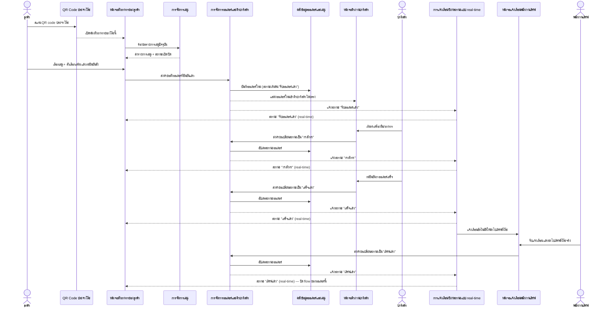
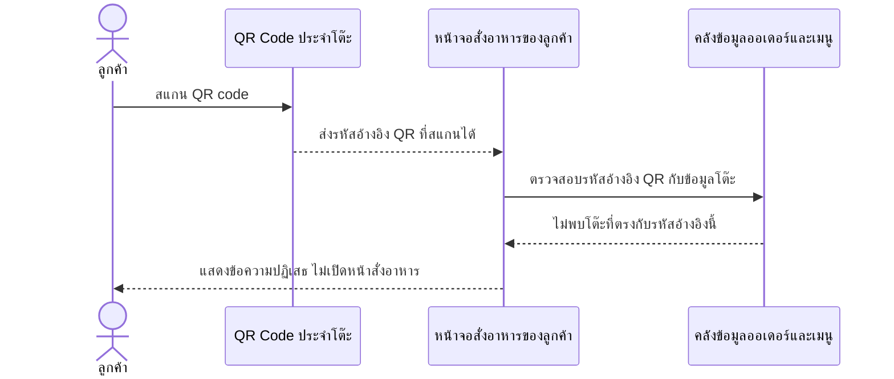
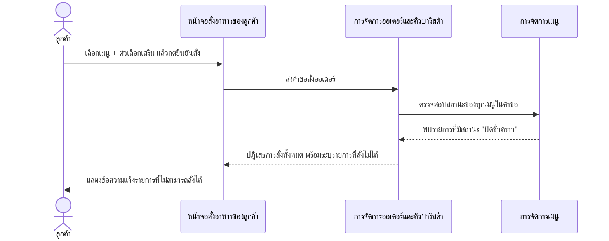
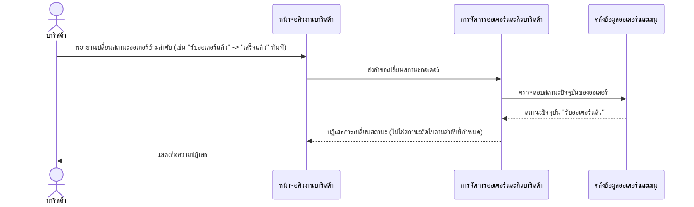
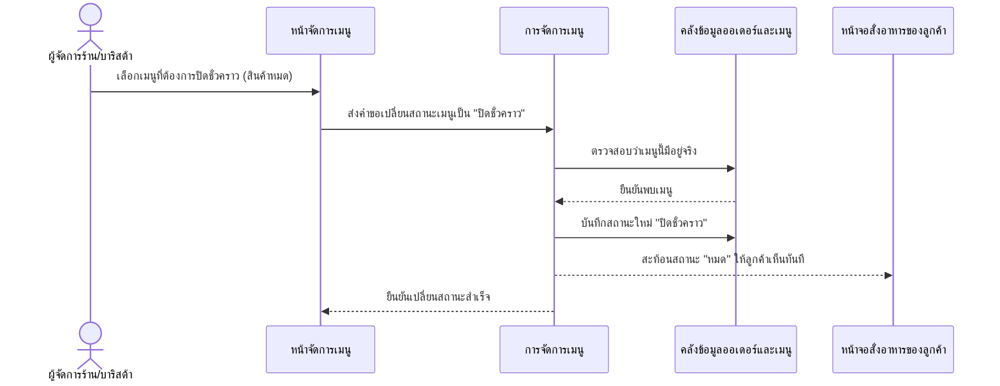

# Detailed Design — ระบบสั่งกาแฟจากโต๊ะด้วยการสแกน QR Code

**อ้างอิง Requirement:** [[../../../01-requirements/01-spec/20260802-001-table-qr-ordering|20260802-001]]
**อ้างอิง User Journey:** [[../../01-prototypes/20260802-001-table-qr-ordering-journey|เปิด journey]]
**อ้างอิง API Spec:** [[../api-spec#2.1 ออเดอร์|ออเดอร์]], [[../api-spec#2.3 โต๊ะ|โต๊ะ]], [[../api-spec#2.4 เมนู|เมนู]]
**วันที่:** 2026-08-23
**สถานะ:** ร่าง (Draft)

> เอกสารนี้เป็นการออกแบบเชิงแนวคิด (Conceptual Detailed Design) **ยังไม่ผูกมัดกับเทคโนโลยี เฟรมเวิร์ก หรือ protocol ใด ๆ** การออกแบบ interaction เชิงเทคนิคจริงจะถูกจัดทำแยกต่างหากเมื่อมีการตัดสินใจเรื่อง stack แล้ว

## 1. ภาพรวม

ฟีเจอร์นี้ครอบคลุม flow หลักของร้าน: ลูกค้าสแกน QR code ประจำโต๊ะเพื่อเปิดหน้าสั่งอาหารโดยไม่ต้องติดตั้งแอปหรือมีบัญชี เลือกเมนูพร้อมตัวเลือกเสริมครบทุกมิติแล้วยืนยันสั่ง ออเดอร์เข้าคิวบาริสต้าโดยตรงทันทีโดยไม่ผ่านพนักงานเสิร์ฟกดรับก่อน สถานะออเดอร์ไหลตามลำดับ "รับออเดอร์แล้ว -> กำลังทำ -> เสร็จแล้ว -> เสิร์ฟแล้ว" และถูกกระจายกลับไปยังหน้าจอลูกค้าแบบ real-time ตลอดเวลา เมื่อบาริสต้ากดยืนยันว่าออเดอร์เสร็จ ระบบต้องแจ้งเตือนพนักงานเสิร์ฟให้นำไปเสิร์ฟที่โต๊ะโดยอัตโนมัติ นอกจากนี้ผู้จัดการร้าน/บาริสต้ายังปิด-เปิดเมนูรายการชั่วคราวได้เองแบบ manual toggle เมื่อสินค้าหมด บทบาทที่เกี่ยวข้องคือ ลูกค้า, บาริสต้า/คนชงกาแฟ, พนักงานเสิร์ฟ และผู้จัดการร้าน (อ้างอิง [[../high-level-architecture#2. บทบาทและผู้เกี่ยวข้อง (Actors)|high-level-architecture.md หัวข้อ 2]] ซึ่งรวมบทบาทนี้ไว้ในกลุ่ม "ผู้บริหารร้าน" ร่วมกับเจ้าของร้าน)

## 2. Sequence Flow

### 2.1 กรณีปกติ (Happy Path): สั่งออเดอร์จนถึงเสิร์ฟเสร็จ

**ลำดับขั้นตอนโดยละเอียด:**

| Step | ผู้กระทำ/องค์ประกอบ | การกระทำ | ข้อมูลที่เกี่ยวข้อง | การตรวจสอบ/กฎธุรกิจ (Validation) | กรณีผิดพลาดและผลลัพธ์ (ถ้ามี) |
|---|---|---|---|---|---|
| 1 | ลูกค้า / QR Code ประจำโต๊ะ | สแกน QR code ประจำโต๊ะเพื่อเปิดหน้าสั่งอาหาร | รหัสอ้างอิง QR code ประจำโต๊ะ, รหัสโต๊ะ (เอนทิตี "โต๊ะ") | ไม่ต้อง login/มีบัญชี (business rule 20260802-001); รหัส QR ต้องตรงกับโต๊ะที่มีอยู่จริง | ดูสถานการณ์ผิดพลาดใน scenario 2.2 |
| 2 | หน้าจอสั่งอาหารของลูกค้า / การจัดการเมนู | ดึงรายการเมนูปัจจุบันพร้อมสถานะเปิด/ปิด | เอนทิตี "เมนู" (ชื่อเมนู, ราคาปัจจุบัน, สถานะเปิด/ปิด) | เมนูที่สถานะ "ปิดชั่วคราว" ต้องแสดง "หมด" ทันที (business rule 20260802-001) | ไม่มี (เป็น query) |
| 3 | ลูกค้า | เลือกเมนู + ตัวเลือกเสริมครบทุกมิติ (ขนาด/ร้อนเย็น/ความหวาน/ชนิดนม/ท็อปปิ้ง/หมายเหตุ) แล้วกดยืนยันสั่ง | เอนทิตี "รายการสินค้าในออเดอร์" (ตัวเลือกเสริมทุก attribute) | ต้องเลือกครบทุกมิติที่บังคับตาม scope ของ 20260802-001 | ดูสถานการณ์ผิดพลาดใน scenario 2.3 (เมนูถูกปิดชั่วคราว) |
| 4 | หน้าจอสั่งอาหารของลูกค้า / การจัดการออเดอร์และคิวบาริสต้า | สร้างออเดอร์ใหม่ พร้อมรายการสินค้าในออเดอร์ (price snapshot) และเข้าคิวบาริสต้าโดยตรงทันที | เอนทิตี "ออเดอร์" (สถานะเริ่มต้น "รับออเดอร์แล้ว"), "รายการสินค้าในออเดอร์" | operation ต้อง idempotent เชิงแนวคิด (ค่าระบุคำขอซ้ำ); ออเดอร์เข้าคิวบาริสต้าโดยตรง ไม่ผ่านพนักงานเสิร์ฟกดรับก่อน (business rule 20260802-001); กระตุ้นบันทึกเหตุการณ์ "สร้างออเดอร์ใหม่" (อ้างอิง [[audit-log|detailed design ของ 20260802-003]]) | ถ้าโต๊ะไม่มีอยู่จริง หรือมีเมนูรายการใดถูกปิดชั่วคราว -> ปฏิเสธการสั่งทั้งหมด (ดู scenario 2.2, 2.3) |
| 5 | การแจ้งเตือน/ซิงก์สถานะแบบ real-time | กระจายสถานะ "รับออเดอร์แล้ว" ไปยังหน้าจอลูกค้า | เอนทิตี "ออเดอร์" (สถานะออเดอร์) | ลูกค้าต้องเห็นสถานะแบบ real-time ตลอดเวลา (business rule 20260802-001) | ไม่มี |
| 6 | บาริสต้า / หน้าจอคิวงานบาริสต้า | เริ่มทำเครื่องดื่ม/อาหาร แล้วเปลี่ยนสถานะออเดอร์เป็น "กำลังทำ" | เอนทิตี "ออเดอร์" (สถานะออเดอร์) | สถานะต้องไหลตามลำดับที่กำหนดเท่านั้น (ห้ามข้าม/ย้อนกลับ) | ดูสถานการณ์ผิดพลาดใน scenario 2.4 (เปลี่ยนสถานะข้ามลำดับ) |
| 7 | บาริสต้า / หน้าจอคิวงานบาริสต้า | กดยืนยันว่าออเดอร์ทำเสร็จ เปลี่ยนสถานะเป็น "เสร็จแล้ว" | เอนทิตี "ออเดอร์" (สถานะออเดอร์) | ต้องกระตุ้นการแจ้งเตือนพนักงานเสิร์ฟอัตโนมัติทันที (business rule 20260802-001); ทำงานแบบ synchronous เชิงแนวคิด; กระตุ้นบันทึกเหตุการณ์ "เปลี่ยนสถานะออเดอร์" | ดูสถานการณ์ผิดพลาดใน scenario 2.4 |
| 8 | การแจ้งเตือน/ซิงก์สถานะแบบ real-time / หน้าจอแจ้งเตือนพนักงานเสิร์ฟ | แจ้งเตือนพนักงานเสิร์ฟอัตโนมัติให้นำไปเสิร์ฟที่โต๊ะ พร้อมกระจายสถานะ "เสร็จแล้ว" ไปยังลูกค้า | เอนทิตี "ออเดอร์" (โต๊ะที่สั่ง, สถานะออเดอร์) | ต้องเกิดทันทีที่บาริสต้ากดยืนยันเสร็จ (business rule 20260802-001) | ไม่มี |
| 9 | พนักงานเสิร์ฟ | นำเครื่องดื่ม/อาหารไปเสิร์ฟที่โต๊ะจริง แล้วเปลี่ยนสถานะเป็น "เสิร์ฟแล้ว" | เอนทิตี "ออเดอร์" (สถานะออเดอร์) | สถานะต้องไหลตามลำดับที่กำหนด ("เสร็จแล้ว" -> "เสิร์ฟแล้ว" เท่านั้น) | ดูสถานการณ์ผิดพลาดใน scenario 2.4 |
| 10 | การแจ้งเตือน/ซิงก์สถานะแบบ real-time | กระจายสถานะสุดท้าย "เสิร์ฟแล้ว" ไปยังหน้าจอลูกค้า ปิด flow ของออเดอร์นี้ | เอนทิตี "ออเดอร์" (สถานะออเดอร์) | ลูกค้าต้องเห็นสถานะแบบ real-time ตลอดเวลา (business rule 20260802-001) | ไม่มี |

### 2.2 กรณีข้อผิดพลาด: สแกน QR code ที่ไม่ตรงกับโต๊ะใดในระบบ

**ลำดับขั้นตอนโดยละเอียด:**

| Step | ผู้กระทำ/องค์ประกอบ | การกระทำ | ข้อมูลที่เกี่ยวข้อง | การตรวจสอบ/กฎธุรกิจ (Validation) | กรณีผิดพลาดและผลลัพธ์ (ถ้ามี) |
|---|---|---|---|---|---|
| 1 | ลูกค้า / QR Code ประจำโต๊ะ | สแกน QR code | รหัสอ้างอิง QR code | ไม่ต้อง login เพื่อเรียก operation นี้ | - |
| 2 | หน้าจอสั่งอาหารของลูกค้า | ตรวจสอบรหัสอ้างอิง QR กับข้อมูลโต๊ะที่มีอยู่จริง | เอนทิตี "โต๊ะ" (รหัสอ้างอิง QR code ประจำโต๊ะ) | รหัสอ้างอิง QR ต้องตรงกับโต๊ะที่มีอยู่จริง (business exception ของ operation "เปิดหน้าสั่งอาหารของโต๊ะจากการสแกน QR" ใน api-spec.md) | ถ้าไม่ตรงกับโต๊ะใด -> ปฏิเสธ ไม่เปิดหน้าสั่งอาหาร แสดงข้อความให้ลูกค้าทราบ |

### 2.3 กรณีข้อผิดพลาด: เมนูที่เลือกถูกปิดชั่วคราว ณ ขณะยืนยันสั่ง

**ลำดับขั้นตอนโดยละเอียด:**

| Step | ผู้กระทำ/องค์ประกอบ | การกระทำ | ข้อมูลที่เกี่ยวข้อง | การตรวจสอบ/กฎธุรกิจ (Validation) | กรณีผิดพลาดและผลลัพธ์ (ถ้ามี) |
|---|---|---|---|---|---|
| 1 | ลูกค้า | เลือกเมนู (ซึ่งอาจถูกปิดชั่วคราวไปแล้วระหว่างที่ลูกค้ากำลังเลือก) + ตัวเลือกเสริม แล้วกดยืนยันสั่ง | เอนทิตี "รายการสินค้าในออเดอร์" (เมนูที่สั่ง) | เมนูทุกรายการที่เลือกต้องอยู่ในสถานะ "เปิดขาย" ณ ขณะยืนยันสั่ง (precondition ของ operation "สั่งออเดอร์" ใน api-spec.md) | - |
| 2 | การจัดการออเดอร์และคิวบาริสต้า / การจัดการเมนู | ตรวจสอบสถานะของทุกเมนูในคำขอ ณ ขณะยืนยัน | เอนทิตี "เมนู" (สถานะเปิด/ปิด) | ต้องตรวจสอบสถานะล่าสุด ไม่ใช้สถานะที่ลูกค้าเห็นตอนเปิดหน้าจอครั้งแรก | ถ้ามีเมนูรายการใดมีสถานะ "ปิดชั่วคราว" อยู่ ณ ขณะยืนยัน -> ปฏิเสธการสั่งทั้งหมด และระบุให้ลูกค้าทราบว่ารายการใดสั่งไม่ได้ (business exception ของ operation "สั่งออเดอร์" ใน api-spec.md) |

### 2.4 กรณีข้อผิดพลาด: เปลี่ยนสถานะออเดอร์ข้ามลำดับ/ย้อนกลับ

**ลำดับขั้นตอนโดยละเอียด:**

| Step | ผู้กระทำ/องค์ประกอบ | การกระทำ | ข้อมูลที่เกี่ยวข้อง | การตรวจสอบ/กฎธุรกิจ (Validation) | กรณีผิดพลาดและผลลัพธ์ (ถ้ามี) |
|---|---|---|---|---|---|
| 1 | บาริสต้า / หน้าจอคิวงานบาริสต้า | ส่งคำขอเปลี่ยนสถานะออเดอร์เป็นสถานะใหม่ที่ระบุ | เอนทิตี "ออเดอร์" (รหัสออเดอร์, สถานะใหม่ที่ขอ) | ออเดอร์ต้องมีอยู่จริง และสถานะปัจจุบันต้องเป็นสถานะก่อนหน้าสถานะใหม่ตามลำดับที่กำหนด (precondition ของ operation "เปลี่ยนสถานะออเดอร์" ใน api-spec.md) | - |
| 2 | การจัดการออเดอร์และคิวบาริสต้า | ตรวจสอบสถานะปัจจุบันของออเดอร์เทียบกับสถานะใหม่ที่ขอ | เอนทิตี "ออเดอร์" (สถานะออเดอร์) | สถานะต้องไหลตามลำดับ "รับออเดอร์แล้ว -> กำลังทำ -> เสร็จแล้ว -> เสิร์ฟแล้ว" เท่านั้น ห้ามข้ามลำดับหรือย้อนกลับ (business rule ของ operation "เปลี่ยนสถานะออเดอร์" ใน api-spec.md) | ถ้าสถานะใหม่ที่ขอไม่ใช่สถานะถัดไปตามลำดับ หรือออเดอร์ไม่มีอยู่จริง -> ปฏิเสธการเปลี่ยนสถานะ (business exception ใน api-spec.md) |

### 2.5 กรณีปกติ: ผู้จัดการร้าน/บาริสต้าปิดเมนูชั่วคราวเมื่อสินค้าหมด

**ลำดับขั้นตอนโดยละเอียด:**

| Step | ผู้กระทำ/องค์ประกอบ | การกระทำ | ข้อมูลที่เกี่ยวข้อง | การตรวจสอบ/กฎธุรกิจ (Validation) | กรณีผิดพลาดและผลลัพธ์ (ถ้ามี) |
|---|---|---|---|---|---|
| 1 | ผู้จัดการร้าน/บาริสต้า | เลือกเมนูรายการที่ต้องการปิดชั่วคราว | เอนทิตี "เมนู" (รหัสเมนู) | ผู้จัดการร้านและบาริสต้ามีสิทธิ์ทำรายการนี้ (business rule 20260802-001) | - |
| 2 | การจัดการเมนู | ตรวจสอบว่าเมนูที่ระบุมีอยู่จริง แล้วบันทึกสถานะใหม่ "ปิดชั่วคราว" | เอนทิตี "เมนู" (สถานะเปิด/ปิด) | ไม่มีการตัดสต็อกอัตโนมัติเกี่ยวข้องกับสถานะนี้ (out of scope); กระตุ้นบันทึกเหตุการณ์ "ปิดเมนู" (อ้างอิง [[audit-log|detailed design ของ 20260802-003]]) | ถ้าเมนูที่ระบุไม่มีอยู่จริง -> ปฏิเสธ (business exception ของ operation "เปิด/ปิดเมนูชั่วคราว" ใน api-spec.md) |
| 3 | การจัดการเมนู / หน้าจอสั่งอาหารของลูกค้า | สะท้อนสถานะ "หมด" ให้ลูกค้าเห็นทันทีที่หน้าสั่งอาหาร | เอนทิตี "เมนู" (สถานะเปิด/ปิด) | ต้องซ่อนหรือแสดงสถานะ "หมด" ทันที (business rule 20260802-001) | ไม่มี |

## 3. การเปลี่ยนสถานะของเอนทิตีที่เกี่ยวข้อง

| เอนทิตี | สถานะก่อนหน้า | Step ที่ทำให้เปลี่ยน | สถานะหลังจากนั้น | เงื่อนไข |
|---|---|---|---|---|
| ออเดอร์ | (ยังไม่มี — ออเดอร์ใหม่) | 2.1 Step 4 (ยืนยันสั่งออเดอร์สำเร็จ) | รับออเดอร์แล้ว | โต๊ะมีอยู่จริง และเมนูทุกรายการอยู่ในสถานะ "เปิดขาย" ณ ขณะยืนยัน (ไม่เข้าเงื่อนไข scenario 2.2/2.3) |
| ออเดอร์ | รับออเดอร์แล้ว | 2.1 Step 6 (บาริสต้าเริ่มทำ) | กำลังทำ | บาริสต้ากดเริ่มทำผ่านหน้าจอคิวงานบาริสต้า |
| ออเดอร์ | กำลังทำ | 2.1 Step 7 (บาริสต้ากดยืนยันเสร็จ) | เสร็จแล้ว | บาริสต้ากดยืนยันว่าออเดอร์ทำเสร็จ -> กระตุ้นแจ้งเตือนพนักงานเสิร์ฟอัตโนมัติทันที |
| ออเดอร์ | เสร็จแล้ว | 2.1 Step 9 (พนักงานเสิร์ฟนำไปเสิร์ฟจริงแล้วกดยืนยัน) | เสิร์ฟแล้ว | ต้องนำไปเสิร์ฟที่โต๊ะจริงก่อนจึงกดยืนยันได้ ปิด flow ของออเดอร์นี้ |
| ออเดอร์ | (สถานะใด ๆ) | 2.4 Step 1-2 (พยายามเปลี่ยนสถานะข้ามลำดับ/ย้อนกลับ) | คงสถานะเดิม (ไม่เปลี่ยน) | ปฏิเสธการเปลี่ยนสถานะเมื่อสถานะใหม่ที่ขอไม่ใช่สถานะถัดไปตามลำดับที่กำหนด |
| เมนู | เปิดขาย | 2.5 Step 2 (ผู้จัดการร้าน/บาริสต้าปิดเมนูชั่วคราว) | ปิดชั่วคราว | ผู้จัดการร้านหรือบาริสต้ากดปิดเมื่อสินค้าหมด (manual toggle) |

## 4. องค์ประกอบ/Operation ที่เกี่ยวข้อง

- **องค์ประกอบเชิงแนวคิด:** [[../high-level-architecture#4. องค์ประกอบเชิงแนวคิด (Conceptual Components)|high-level-architecture.md หัวข้อ 4]] — หน้าจอสั่งอาหารของลูกค้า, หน้าจอคิวงานบาริสต้า, หน้าจอแจ้งเตือนพนักงานเสิร์ฟ, หน้าจัดการเมนูของผู้บริหารร้าน, การจัดการออเดอร์และคิวบาริสต้า, การจัดการเมนู, การแจ้งเตือน/ซิงก์สถานะแบบ real-time, คลังข้อมูลออเดอร์และเมนู
- **Operation ที่เกี่ยวข้อง:** [[../api-spec#2.1 ออเดอร์|api-spec.md หัวข้อ 2.1 ออเดอร์]] (สั่งออเดอร์, ดูคิวออเดอร์สำหรับบาริสต้า, เปลี่ยนสถานะออเดอร์, ติดตามสถานะออเดอร์แบบต่อเนื่อง), [[../api-spec#2.3 โต๊ะ|2.3 โต๊ะ]] (เปิดหน้าสั่งอาหารของโต๊ะจากการสแกน QR), [[../api-spec#2.4 เมนู|2.4 เมนู]] (ดูรายการเมนูปัจจุบัน, เปิด/ปิดเมนูชั่วคราว)
- **เอนทิตีข้อมูลที่เกี่ยวข้อง:** [[../database-schema#3.1 ออเดอร์|database-schema.md 3.1 ออเดอร์]], [[../database-schema#3.2 รายการสินค้าในออเดอร์|3.2 รายการสินค้าในออเดอร์]], [[../database-schema#3.3 โต๊ะ|3.3 โต๊ะ]], [[../database-schema#3.4 เมนู|3.4 เมนู]]

## 5. ประเด็นที่ยังไม่ชัดเจน / รอการตัดสินใจ (Open Questions)

- high-level-architecture.md ไม่ได้นิยามองค์ประกอบเชิงประมวลผลเฉพาะสำหรับการตรวจสอบ QR/โต๊ะ (ไม่มี "การจัดการโต๊ะ" เป็นองค์ประกอบแยก) เอกสารนี้จึงสมมติให้ "หน้าจอสั่งอาหารของลูกค้า" ตรวจสอบรหัสอ้างอิง QR กับ "คลังข้อมูลออเดอร์และเมนู" โดยตรงใน scenario 2.2 — ควรตรวจสอบยืนยันกับทีมสถาปัตยกรรมอีกครั้งว่าต้องมีองค์ประกอบเฉพาะสำหรับ "การจัดการโต๊ะ" แยกออกมาหรือไม่ในรอบถัดไป

## เอกสารที่เกี่ยวข้อง

- [[../../../01-requirements/01-spec/20260802-001-table-qr-ordering|spec ต้นทาง]]
- [[../high-level-architecture|high-level-architecture.md]]
- [[../database-schema|database-schema.md]]
- [[../api-spec|api-spec.md]]
- [[index|detailed-design]]

## ประวัติการแก้ไข

- 2026-08-23: สร้างไฟล์ใหม่ทั้งหมด ครอบคลุม 5 scenario (happy path ของ order flow หลัก, error กรณี QR ไม่ตรงโต๊ะ, error กรณีเมนูถูกปิดชั่วคราว, error กรณีเปลี่ยนสถานะข้ามลำดับ, happy path ของการปิดเมนูชั่วคราว) พร้อมตารางการเปลี่ยนสถานะของเอนทิตี "ออเดอร์" และ "เมนู" ตามที่ user ยืนยันให้ใส่เพิ่มเติมสำหรับ feature นี้ อ้างอิง spec, journey และ api-spec operation ของหมวดออเดอร์/โต๊ะ/เมนูทั้งหมด
