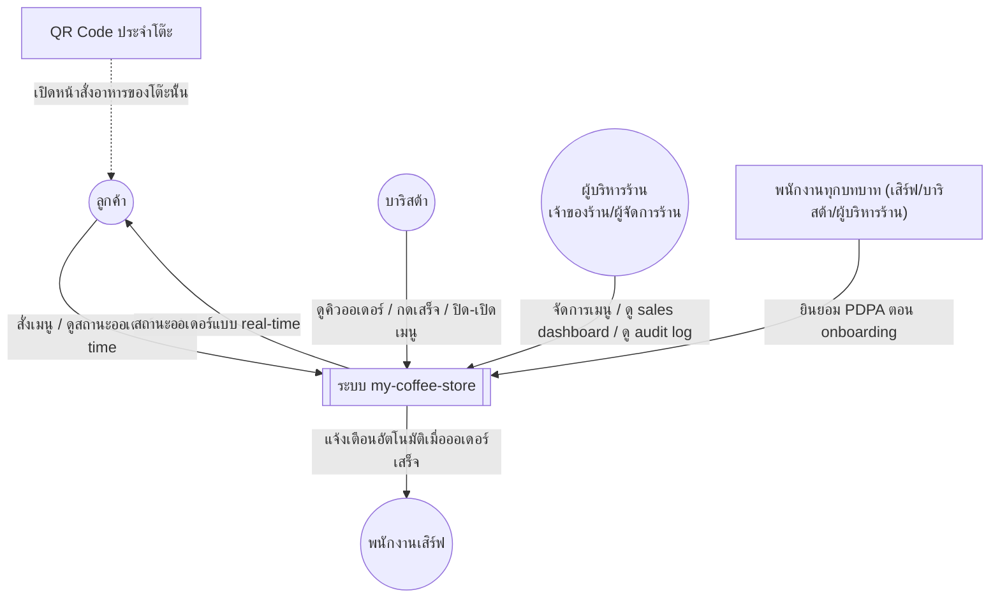
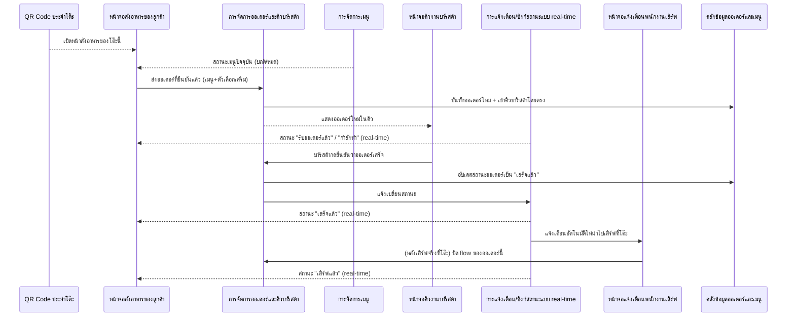
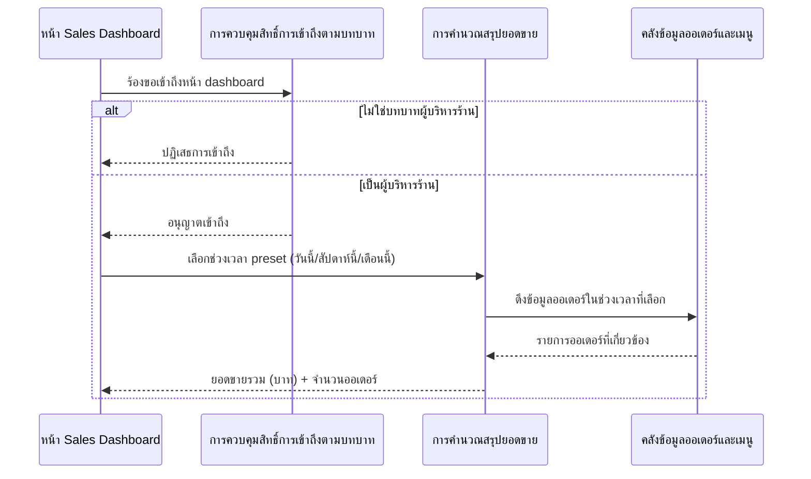
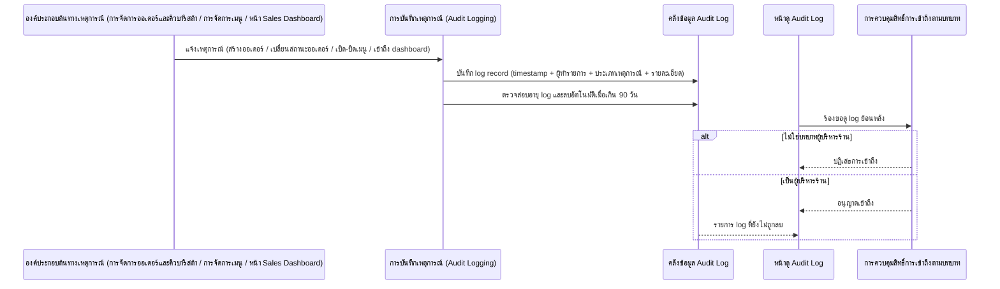
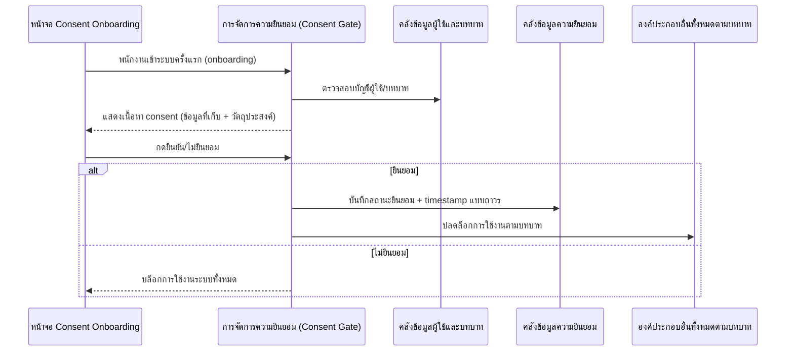

# High-Level Architecture (Conceptual)

**วันที่จัดทำ/อัปเดตล่าสุด:** 2026-08-23
**สถานะ:** ร่าง (Draft)

> เอกสารนี้เป็นสถาปัตยกรรมเชิงแนวคิด (Conceptual Architecture) **ยังไม่ผูกมัดกับเทคโนโลยี เฟรมเวิร์ก หรือฐานข้อมูลใด ๆ** การเลือก tech stack จริงและรายละเอียดเชิงเทคนิค (database schema, API design) จะถูกจัดทำแยกต่างหากภายใต้ [[index|02-technical]] เมื่อมีการตัดสินใจเรื่อง stack แล้ว

## 1. ภาพรวมระบบ (System Overview)

my-coffee-store คือระบบสนับสนุนการดำเนินงานของร้านกาแฟหน้าร้านเดียว (single-branch) ที่มีแกนกลางเป็น "การสั่งเครื่องดื่มจากโต๊ะผ่านการสแกน QR code" ([[../../01-requirements/01-spec/20260802-001-table-qr-ordering|20260802-001]]) ซึ่งเชื่อมโยงลูกค้า บาริสต้า และพนักงานเสิร์ฟเข้าด้วยกันแบบ real-time โดยไม่ต้องพึ่งพนักงานรับออเดอร์ที่เคาน์เตอร์ จากข้อมูลออเดอร์ที่เกิดขึ้น ระบบต่อยอดเป็นฟีเจอร์สนับสนุนอีก 3 ส่วน ได้แก่ หน้าสรุปยอดขายสำหรับผู้บริหารร้าน (เจ้าของร้าน/ผู้จัดการร้าน) ([[../../01-requirements/01-spec/20260802-002-sales-dashboard|20260802-002]]), การบันทึกเหตุการณ์สำคัญเพื่อการตรวจสอบย้อนหลัง ([[../../01-requirements/01-spec/20260802-003-audit-log|20260802-003]]), และกลไกขอความยินยอมตาม PDPA จากพนักงานก่อนเริ่มใช้งานระบบ ([[../../01-requirements/01-spec/20260802-004-pdpa-consent|20260802-004]]) ระบบไม่มีการชำระเงินออนไลน์และไม่มีระบบตัดสต็อกอัตโนมัติในเฟสนี้

## 2. บทบาทและผู้เกี่ยวข้อง (Actors)

| บทบาท | หน้าที่ในระบบ | อ้างอิง Requirement |
|---|---|---|
| ลูกค้า | สแกน QR ประจำโต๊ะ, เลือกเมนู+ตัวเลือกเสริม, ยืนยันสั่ง, ติดตามสถานะออเดอร์แบบ real-time | [[../../01-requirements/01-spec/20260802-001-table-qr-ordering|20260802-001]] |
| บาริสต้า/คนชงกาแฟ | เห็นคิวออเดอร์ที่เข้ามาโดยตรง ทำเครื่องดื่ม/อาหาร กดยืนยันเสร็จ, ปิด/เปิดเมนูชั่วคราวเมื่อสินค้าหมด, ยินยอม PDPA ก่อนใช้งาน | [[../../01-requirements/01-spec/20260802-001-table-qr-ordering|20260802-001]], [[../../01-requirements/01-spec/20260802-004-pdpa-consent|20260802-004]] |
| พนักงานเสิร์ฟ | รับการแจ้งเตือนอัตโนมัติเมื่อออเดอร์ทำเสร็จ แล้วนำไปเสิร์ฟที่โต๊ะ, ยินยอม PDPA ก่อนใช้งาน | [[../../01-requirements/01-spec/20260802-001-table-qr-ordering|20260802-001]], [[../../01-requirements/01-spec/20260802-004-pdpa-consent|20260802-004]] |
| ผู้บริหารร้าน (เจ้าของร้าน/ผู้จัดการร้าน) | จัดการเมนู รวมถึงปิด/เปิดเมนูรายการที่หมดชั่วคราว, ดูหน้า Sales Dashboard (ยอดขายรวม+จำนวนออเดอร์ตาม preset ช่วงเวลา), เข้าถึงหน้าดู audit log ย้อนหลัง, ยินยอม PDPA ก่อนใช้งาน | [[../../01-requirements/01-spec/20260802-001-table-qr-ordering|20260802-001]], [[../../01-requirements/01-spec/20260802-002-sales-dashboard|20260802-002]], [[../../01-requirements/01-spec/20260802-003-audit-log|20260802-003]], [[../../01-requirements/01-spec/20260802-004-pdpa-consent|20260802-004]] |

## 3. System Context Diagram

ระบบทั้งหมดถูกมองเป็นกล่องเดียวจากมุมมองภายนอก โดยมี QR code ประจำโต๊ะเป็นจุดกระตุ้น (physical trigger) ให้ลูกค้าเข้าสู่ระบบโดยไม่ต้องติดตั้งแอปหรือมีบัญชีผู้ใช้ ส่วนพนักงานทุกบทบาทต้องผ่านขั้นตอนยินยอม PDPA ก่อนจึงจะเข้าถึงฟังก์ชันตามบทบาทของตนได้ ระบบไม่มีการเชื่อมต่อกับระบบภายนอกอื่น (เช่น ระบบชำระเงิน) ในเฟสนี้

## 4. องค์ประกอบเชิงแนวคิด (Conceptual Components)

ใช้กรอบแนวคิดแบบ **layer แบบง่าย** แบ่งเป็น 4 ชั้น: ส่วนที่ผู้ใช้โต้ตอบ, ส่วนประมวลผลหลัก, ส่วนเก็บข้อมูล, และระบบ/อุปกรณ์ภายนอก

### 4.1 ชั้นที่ผู้ใช้โต้ตอบ (User Interaction Layer)

| องค์ประกอบ | ความรับผิดชอบหลัก | ตอบสนอง Feature/Requirement ไหน |
|---|---|---|
| หน้าจอสั่งอาหารของลูกค้า | เปิดจากการสแกน QR, แสดงเมนู+สถานะเปิด/ปิด, รับตัวเลือกเสริม, แสดงสถานะออเดอร์แบบ real-time | [[../../01-requirements/01-spec/20260802-001-table-qr-ordering|20260802-001]] |
| หน้าจอคิวงานบาริสต้า | แสดงคิวออเดอร์ที่เข้ามาโดยตรง, รับการกดยืนยันเสร็จ, ปิด/เปิดเมนูชั่วคราว | [[../../01-requirements/01-spec/20260802-001-table-qr-ordering|20260802-001]] |
| หน้าจอแจ้งเตือนพนักงานเสิร์ฟ | รับแจ้งเตือนอัตโนมัติเมื่อออเดอร์เสร็จ พร้อมข้อมูลโต๊ะที่ต้องเสิร์ฟ | [[../../01-requirements/01-spec/20260802-001-table-qr-ordering|20260802-001]] |
| หน้าจัดการเมนูของผู้บริหารร้าน | เปิด/ปิดเมนูรายการชั่วคราว | [[../../01-requirements/01-spec/20260802-001-table-qr-ordering|20260802-001]] |
| หน้า Sales Dashboard | เลือกช่วงเวลา preset (วันนี้/สัปดาห์นี้/เดือนนี้), แสดงยอดขายรวม+จำนวนออเดอร์ | [[../../01-requirements/01-spec/20260802-002-sales-dashboard|20260802-002]] |
| หน้าดู Audit Log | แสดงรายการ log ย้อนหลัง เฉพาะบทบาทที่มีสิทธิ์ | [[../../01-requirements/01-spec/20260802-003-audit-log|20260802-003]] |
| หน้าจอ Consent Onboarding | แสดงเนื้อหายินยอม PDPA แบบง่าย, รับการกดยืนยัน/ปฏิเสธ | [[../../01-requirements/01-spec/20260802-004-pdpa-consent|20260802-004]] |

### 4.2 ชั้นประมวลผลหลัก (Core Processing Layer)

| องค์ประกอบ | ความรับผิดชอบหลัก | ตอบสนอง Feature/Requirement ไหน |
|---|---|---|
| การจัดการออเดอร์และคิวบาริสต้า | รับออเดอร์ที่ลูกค้ายืนยันแล้ว จัดเข้าคิวบาริสต้าโดยตรงทันที (ไม่ผ่านพนักงานเสิร์ฟกดรับก่อน), ปรับสถานะออเดอร์ตามลำดับ | [[../../01-requirements/01-spec/20260802-001-table-qr-ordering|20260802-001]] |
| การแจ้งเตือน/ซิงก์สถานะแบบ real-time | กระจายสถานะออเดอร์ไปยังหน้าจอลูกค้าแบบต่อเนื่อง, แจ้งเตือนพนักงานเสิร์ฟอัตโนมัติทันทีที่บาริสต้ากดเสร็จ | [[../../01-requirements/01-spec/20260802-001-table-qr-ordering|20260802-001]] |
| การจัดการเมนู | เปิด/ปิดเมนูชั่วคราว (manual toggle, ไม่มีตัดสต็อกอัตโนมัติ), สะท้อนสถานะไปหน้าจอลูกค้าทันที | [[../../01-requirements/01-spec/20260802-001-table-qr-ordering|20260802-001]] |
| การคำนวณสรุปยอดขาย | รวมยอดขาย (จำนวนเงิน) และนับจำนวนออเดอร์ตามช่วงเวลา preset จากข้อมูลออเดอร์ | [[../../01-requirements/01-spec/20260802-002-sales-dashboard|20260802-002]] |
| การควบคุมสิทธิ์การเข้าถึงตามบทบาท (Access Control) | ตรวจสอบบทบาทผู้ใช้ก่อนอนุญาตเข้าหน้า Sales Dashboard และหน้า Audit Log | [[../../01-requirements/01-spec/20260802-002-sales-dashboard|20260802-002]], [[../../01-requirements/01-spec/20260802-003-audit-log|20260802-003]] |
| การบันทึกเหตุการณ์ (Audit Logging) | ดักจับเหตุการณ์จากองค์ประกอบอื่น (สร้างออเดอร์, เปลี่ยนสถานะออเดอร์, เปิด/ปิดเมนู, เข้าถึง dashboard) บันทึกเป็น log record พร้อม timestamp+ผู้ทำรายการ, ลบ log ที่เกิน 90 วันอัตโนมัติ | [[../../01-requirements/01-spec/20260802-003-audit-log|20260802-003]] |
| การจัดการความยินยอม (Consent Gate) | ตรวจสอบสถานะยินยอมของพนักงานก่อนอนุญาตเข้าใช้งานองค์ประกอบอื่นใดในระบบ, บันทึกสถานะยินยอม+timestamp แบบถาวร | [[../../01-requirements/01-spec/20260802-004-pdpa-consent|20260802-004]] |

### 4.3 ชั้นเก็บข้อมูล (Data Storage Layer)

| องค์ประกอบ | ความรับผิดชอบหลัก | ตอบสนอง Feature/Requirement ไหน |
|---|---|---|
| คลังข้อมูลออเดอร์และเมนู | เก็บออเดอร์, รายการสินค้าในออเดอร์, ข้อมูลเมนูและสถานะเปิด/ปิด | [[../../01-requirements/01-spec/20260802-001-table-qr-ordering|20260802-001]], [[../../01-requirements/01-spec/20260802-002-sales-dashboard|20260802-002]] |
| คลังข้อมูลผู้ใช้และบทบาท | เก็บบัญชีพนักงานและบทบาท (ลูกค้าไม่มีบัญชี) | [[../../01-requirements/01-spec/20260802-001-table-qr-ordering|20260802-001]], [[../../01-requirements/01-spec/20260802-004-pdpa-consent|20260802-004]] |
| คลังข้อมูล Audit Log | เก็บ log record ตามนโยบายเก็บรักษา 90 วัน แล้วลบอัตโนมัติ | [[../../01-requirements/01-spec/20260802-003-audit-log|20260802-003]] |
| คลังข้อมูลความยินยอม (Consent) | เก็บสถานะยินยอม+timestamp ต่อพนักงานแบบถาวร แยกจากนโยบาย retention ของ audit log | [[../../01-requirements/01-spec/20260802-004-pdpa-consent|20260802-004]] |

### 4.4 ชั้นระบบ/อุปกรณ์ภายนอก (External Systems / Devices Layer)

| องค์ประกอบ | ความรับผิดชอบหลัก | ตอบสนอง Feature/Requirement ไหน |
|---|---|---|
| QR Code ประจำโต๊ะ | เป็นจุดกระตุ้น (physical trigger) ให้เปิดหน้าสั่งอาหารของโต๊ะนั้น ไม่ใช่องค์ประกอบประมวลผลของระบบ | [[../../01-requirements/01-spec/20260802-001-table-qr-ordering|20260802-001]] |
| อุปกรณ์ปลายทางของผู้ใช้งาน (มือถือ/แท็บเล็ตของลูกค้าและพนักงาน) | เป็นช่องทางที่ผู้ใช้แต่ละบทบาทเข้าถึงหน้าจอต่าง ๆ ของระบบ | ทุก requirement |

## 5. Data Flow ตาม User Journey

### 5.1 ระบบสั่งกาแฟจากโต๊ะด้วยการสแกน QR Code

**อ้างอิง Journey:** [[../01-prototypes/20260802-001-table-qr-ordering-journey|เปิด journey]]

ลูกค้าสแกน QR ที่โต๊ะเพื่อเปิดหน้าสั่งอาหาร โดยระหว่างเลือกเมนูจะเห็นสถานะเปิด/ปิดของแต่ละรายการที่มาจากองค์ประกอบ "การจัดการเมนู" เมื่อยืนยันสั่ง ข้อมูลออเดอร์ไหลจากหน้าจอลูกค้าเข้าสู่ "การจัดการออเดอร์และคิวบาริสต้า" ซึ่งบันทึกลงคลังข้อมูลและส่งต่อไปยังหน้าจอคิวของบาริสต้าทันทีโดยไม่ผ่านพนักงานเสิร์ฟ เมื่อบาริสต้ากดยืนยันเสร็จ องค์ประกอบ "การแจ้งเตือน/ซิงก์สถานะแบบ real-time" จะกระจายสถานะกลับไปยังหน้าจอลูกค้าอย่างต่อเนื่อง และแจ้งเตือนพนักงานเสิร์ฟโดยอัตโนมัติในเวลาเดียวกัน

### 5.2 หน้า Dashboard ดูยอดขาย

**อ้างอิง Journey:** [[../01-prototypes/20260802-002-sales-dashboard-journey|เปิด journey]]

เมื่อผู้ใช้เข้าหน้า Sales Dashboard องค์ประกอบ "การควบคุมสิทธิ์การเข้าถึงตามบทบาท" จะตรวจสอบก่อนว่าเป็นผู้บริหารร้าน (เจ้าของร้าน/ผู้จัดการร้าน) หรือไม่ ถ้าไม่ใช่จะถูกปฏิเสธทันที หากผ่านการตรวจสอบ ผู้ใช้เลือกช่วงเวลาแบบ preset แล้วข้อมูลจะไหลจาก "การคำนวณสรุปยอดขาย" ไปดึงออเดอร์ที่เกี่ยวข้องจาก "คลังข้อมูลออเดอร์และเมนู" (ซึ่งเป็นคลังเดียวกับที่ requirement 20260802-001 บันทึกไว้) แล้วสรุปผลกลับมาแสดงบนหน้าจอ

### 5.3 ระบบบันทึก Log (Audit Trail)

**อ้างอิง Journey:** [[../01-prototypes/20260802-003-audit-log-journey|เปิด journey]]

ทุกครั้งที่มีเหตุการณ์สำคัญเกิดขึ้นในองค์ประกอบอื่น (การสร้าง/เปลี่ยนสถานะออเดอร์จาก requirement 20260802-001, การเปิด/ปิดเมนู, หรือการเข้าถึง Sales Dashboard จาก requirement 20260802-002) ข้อมูลเหตุการณ์จะไหลเข้าสู่ "การบันทึกเหตุการณ์" ซึ่งบันทึกลง "คลังข้อมูล Audit Log" พร้อม timestamp และผู้ทำรายการ และมีกลไกตรวจสอบ+ลบ log ที่เกิน 90 วันโดยอัตโนมัติ เมื่อผู้บริหารร้าน (เจ้าของร้าน/ผู้จัดการร้าน) ต้องการดูย้อนหลัง คำขอจะผ่านการตรวจสอบสิทธิ์ก่อนจึงจะเห็นรายการ log ที่ยังไม่ถูกลบ

### 5.4 ขอความยินยอม (Consent) ตาม PDPA จากพนักงาน

**อ้างอิง Journey:** [[../01-prototypes/20260802-004-pdpa-consent-journey|เปิด journey]]

เมื่อพนักงานเข้าระบบครั้งแรกตอน onboarding "การจัดการความยินยอม (Consent Gate)" จะอ้างอิงบัญชีผู้ใช้จาก "คลังข้อมูลผู้ใช้และบทบาท" แล้วแสดงเนื้อหายินยอมแบบง่าย หากพนักงานกดยินยอม สถานะจะถูกบันทึกแบบถาวรใน "คลังข้อมูลความยินยอม" (แยกจากนโยบาย retention ของ audit log) และปลดล็อกให้เข้าถึงองค์ประกอบอื่นตามบทบาทได้ หากไม่ยินยอม ระบบจะบล็อกการใช้งานทั้งหมดทันที

## 6. แบบจำลองข้อมูลเชิงแนวคิด (Conceptual Data Entities)

| เอนทิตี | คำอธิบาย | ความสัมพันธ์หลักกับเอนทิตีอื่น |
|---|---|---|
| ออเดอร์ | คำสั่งซื้อ 1 รายการที่ลูกค้ายืนยันจากโต๊ะหนึ่ง ๆ มีสถานะไหลตามลำดับ (รับออเดอร์แล้ว/กำลังทำ/เสร็จแล้ว/เสิร์ฟแล้ว) | อยู่ภายใต้ 1 โต๊ะ, ประกอบด้วยหลายรายการสินค้าในออเดอร์ |
| รายการสินค้าในออเดอร์ | รายการเมนู 1 ชิ้นในออเดอร์ พร้อมตัวเลือกเสริม (ขนาด/ร้อนเย็น/ความหวาน/ชนิดนม/ท็อปปิ้ง/หมายเหตุ) | เป็นส่วนหนึ่งของออเดอร์ 1 รายการ, อ้างอิงเมนู 1 รายการ |
| โต๊ะ | จุดบริการที่ลูกค้านั่ง ผูกกับ QR code เฉพาะของตน | มีออเดอร์ได้หลายรายการตามช่วงเวลา |
| เมนู | รายการสินค้าที่ร้านเสนอขาย มีสถานะเปิด/ปิดชั่วคราว | ถูกอ้างอิงจากหลายรายการสินค้าในออเดอร์ |
| ผู้ใช้/พนักงาน | บัญชีของพนักงานเสิร์ฟ/บาริสต้า/ผู้บริหารร้าน (เจ้าของร้าน/ผู้จัดการร้าน) แต่ละบัญชีมี 1 บทบาท (ลูกค้าไม่มีบัญชี) | เป็นผู้ทำรายการของ log record หลายรายการ, มีความยินยอม 1 รายการต่อ 1 บัญชี |
| บันทึกเหตุการณ์ (Audit Log Record) | เหตุการณ์ 1 รายการที่เกิดขึ้นในระบบ พร้อม timestamp, ผู้ทำรายการ, ประเภทเหตุการณ์, รายละเอียด | อ้างอิงผู้ใช้/พนักงาน 1 คนเป็นผู้ทำรายการ, มีอายุจำกัด 90 วันก่อนถูกลบอัตโนมัติ |
| ความยินยอม (Consent Record) | สถานะยินยอม PDPA ของพนักงาน 1 คน พร้อม timestamp เก็บแบบถาวร | ผูกกับผู้ใช้/พนักงาน 1 คนแบบหนึ่งต่อหนึ่ง |

ดูรายละเอียด attribute, ชนิดข้อมูลเชิงแนวคิด, ข้อจำกัดเชิงธุรกิจ และ ER Diagram แบบเต็มของแต่ละเอนทิตีได้ใน [[database-schema|database-schema.md]]

## 7. หลักการ/การตัดสินใจเชิงสถาปัตยกรรม (Architectural Principles & Decisions)

- แยกความรับผิดชอบระหว่าง "การรับออเดอร์จากลูกค้า" กับ "การจัดคิวและทำงานของบาริสต้า" ให้เป็นการไหลทางเดียวที่ไม่ต้องรอการกดรับจากพนักงานเสิร์ฟก่อน เพราะ business rule ของ requirement 20260802-001 กำหนดให้ออเดอร์เข้าคิวบาริสต้าโดยตรงทันที ทำให้ทั้งฝั่งลูกค้าและฝั่งบาริสต้าทำงานต่อเนื่องได้แม้อีกฝั่งช้าลง
- ต้องมีองค์ประกอบกลางที่ทำหน้าที่กระจายสถานะออเดอร์และแจ้งเตือนแบบ real-time ระหว่างบทบาท (ลูกค้าเห็นสถานะต่อเนื่อง, พนักงานเสิร์ฟได้รับแจ้งเตือนทันที) แยกออกจากองค์ประกอบจัดการออเดอร์หลัก เพื่อให้การอัปเดตสถานะไม่ผูกติดกับ flow การบันทึกข้อมูลโดยตรง ตามที่ requirement 20260802-001 กำหนดไว้ชัดเจน
- องค์ประกอบฝั่งบาริสต้า (หน้าจอคิวงานบาริสต้า) ต้องมีกลไกเก็บข้อมูลคิวที่โหลดไว้แล้วชั่วคราว และสามารถทำงานต่อได้ในระยะสั้นแม้เครือข่ายขัดข้อง แล้วซิงก์ข้อมูลกลับเมื่อเครือข่ายกลับมา เพื่อรองรับแนวทาง "offline-first บางส่วน" ที่ผู้ใช้ยืนยันไว้ เมื่อเครือข่ายกลับมาและพบว่าข้อมูลสถานะเดียวกัน (เช่น สถานะออเดอร์เดียวกัน) ถูกบันทึกไว้จากหลายอุปกรณ์จนขัดแย้งกัน ให้ยึดกติกาเชิงแนวคิดว่า "ข้อมูลที่ซิงก์เข้าระบบล่าสุดเป็นค่าที่ถูกต้อง" (แทนที่ค่าก่อนหน้าด้วยค่าล่าสุดเสมอ) เพื่อให้ทุกองค์ประกอบเห็นสถานะเดียวกันตรงกันหลัง sync เสร็จ (ยังไม่กำหนดกลไกทางเทคนิคเฉพาะเจาะจงของการ sync ไว้ในเอกสารนี้)
- แยกคลังข้อมูล Audit Log ออกจากคลังข้อมูลความยินยอม (Consent) แม้ทั้งคู่จะเป็นข้อมูลเชิงตรวจสอบย้อนหลัง (accountability) เพราะมีนโยบายเก็บรักษาต่างกันอย่างชัดเจน (90 วันแล้วลบอัตโนมัติ เทียบกับเก็บถาวรไม่มีวันหมดอายุ) ตาม business rule ของ requirement 20260802-003 และ 20260802-004
- "การจัดการความยินยอม (Consent Gate)" ต้องทำหน้าที่เป็นจุดตรวจก่อนเข้าสู่องค์ประกอบอื่นใดที่พนักงานเข้าถึง เพื่อให้เป็น mandatory gate ที่บล็อกการใช้งานทั้งหมดหากยังไม่ยินยอม ตามที่ requirement 20260802-004 กำหนด
- ใช้องค์ประกอบ "การควบคุมสิทธิ์การเข้าถึงตามบทบาท" ร่วมกันสำหรับทั้ง Sales Dashboard และ Audit Log แทนการตรวจสิทธิ์แยกกันคนละจุด เพราะทั้งสอง requirement ใช้แนวคิดจำกัดสิทธิ์แบบเดียวกัน (เฉพาะบทบาท "ผู้บริหารร้าน") หลังจากรวมบทบาท "ผู้จัดการร้าน" กับ "เจ้าของร้าน/แอดมิน" ที่เคยแยกกันในแต่ละ spec ให้เป็นบทบาทเดียวกันแล้ว การตรวจสิทธิ์ทั้งสองจุดจึงอ้างอิงบทบาทเดียวกันโดยตรงไม่มีความคลุมเครืออีกต่อไป

## 8. ข้อจำกัดและสมมติฐาน (Constraints & Assumptions)

- โฟกัสสาขาเดียว (single-branch) ในรอบนี้ ไม่ออกแบบรองรับหลายสาขาหรือ multi-tenant เชิงแนวคิด (ยืนยันจาก user)
- รองรับ offline-first บางส่วน: บาริสต้าต้องเห็น/ทำงานกับคิวออเดอร์ที่โหลดไว้แล้วต่อได้แม้เครือข่ายสะดุดชั่วคราว แล้วซิงก์ข้อมูลกลับเมื่อเครือข่ายกลับมา (ยืนยันจาก user) โดยใช้กติกาเชิงแนวคิด "ข้อมูลที่ซิงก์เข้าระบบล่าสุดเป็นค่าที่ถูกต้อง" เมื่อพบข้อมูลสถานะเดียวกันขัดแย้งกันจากหลายอุปกรณ์ (ยืนยันจาก user) — ยังไม่กำหนดกลไกทางเทคนิคเฉพาะเจาะจงของการ sync ไว้ในเอกสารนี้
- ระบบต้องรองรับร้านขนาดกลางทั่วไป ประมาณ 15-30 โต๊ะ และผู้ใช้งานพร้อมกันในระดับหลักสิบคน (ยืนยันจาก user เป็นสมมติฐานเบื้องต้น ยังไม่ใช่ตัวเลขยืนยันจากข้อมูลร้านจริง ควรตรวจสอบซ้ำกับเจ้าของร้านจริงอีกครั้งก่อนออกแบบเชิงเทคนิคในรายละเอียด)
- ลูกค้าไม่มีบัญชีผู้ใช้และไม่ต้อง login เพื่อสั่งอาหาร (ตาม spec 20260802-001 และ 20260802-004)
- ไม่มีระบบชำระเงินออนไลน์, ระบบตัดสต็อกอัตโนมัติ, หรือระบบจองโต๊ะในเฟสนี้ (out of scope ของ 20260802-001)
- หน้า Sales Dashboard จำกัดเฉพาะยอดขายรวมและจำนวนออเดอร์ตาม preset ช่วงเวลาที่กำหนดไว้ล่วงหน้าเท่านั้น ไม่มี custom date range, best seller ranking, period comparison, กราฟแนวโน้ม หรือ export รายงาน (out of scope ของ 20260802-002)
- Audit log ครอบคลุมเฉพาะ application-level business event เท่านั้น ไม่รวม infrastructure/server log และไม่มีการ export หรือ alert อัตโนมัติในเฟสนี้ (out of scope ของ 20260802-003)
- Consent PDPA ครอบคลุมเฉพาะพนักงาน ไม่ครอบคลุมลูกค้า (เพราะปัจจุบันระบบไม่เก็บข้อมูลส่วนบุคคลของลูกค้า) และไม่มีกระบวนการ DPO, data breach notification แบบเป็นทางการ หรือสิทธิเจ้าของข้อมูลแบบละเอียด (out of scope ของ 20260802-004)

## 9. ประเด็นที่ยังไม่ชัดเจน / รอการตัดสินใจ (Open Questions)

ไม่มีประเด็นค้างอยู่ในขณะนี้ ประเด็นทั้ง 3 ที่เคยค้างไว้ (ความสัมพันธ์ระหว่างบทบาท "ผู้จัดการร้าน" กับ "เจ้าของร้าน/แอดมิน", กลไก conflict resolution ตอน sync กลับมาหลัง offline, และขนาด/สเกลของระบบ) ผู้ใช้ได้ยืนยันการตัดสินใจแล้ว และถูกนำไปสะท้อนในหัวข้อ 2, 3, 5.2, 5.3, 6, 7 และ 8 ข้างต้นแล้ว (ดูรายละเอียดใน "ประวัติการแก้ไข" ด้านล่าง)

หากมีประเด็นเชิงแนวคิดใหม่เกิดขึ้นในรอบถัดไป ให้บันทึกเพิ่มในหัวข้อนี้ตามรูปแบบเดิม

## เอกสารที่เกี่ยวข้อง

- [[../../01-requirements/backlog|backlog.md]]
- [[../../01-requirements/feature-list|feature-list.md]]
- [[../01-prototypes/index|01-prototypes]]
- [[index|02-technical]]
- [[../../03-testing/01-test-plan/test-plan|test-plan.md]]

## ประวัติการแก้ไข

- 2026-08-23: สร้างไฟล์ใหม่ทั้งหมด ครอบคลุม requirement/journey ทั้ง 4 รายการ (20260802-001 ถึง 20260802-004) โดยใช้กรอบแนวคิดแบบ layer แบบง่าย (ผู้ใช้โต้ตอบ / ประมวลผลหลัก / เก็บข้อมูล / ระบบภายนอก) อ้างอิง backlog, feature-list, spec และ user journey ทั้งหมดที่มีอยู่ในปัจจุบัน
- 2026-08-23: อัปเดตเพื่อปิด 3 ประเด็นที่เคยค้างไว้ในหัวข้อ 9 ตามการตัดสินใจที่ user ยืนยันแล้ว โดยไม่เปลี่ยนกรอบแนวคิด layer เดิมและไม่เปลี่ยนขอบเขต requirement (ยังคงครอบคลุมทั้ง 4 รายการเดิม):
  - รวมบทบาท "ผู้จัดการร้าน" กับ "เจ้าของร้าน/แอดมิน" เป็นบทบาทเดียวคือ "ผู้บริหารร้าน (เจ้าของร้าน/ผู้จัดการร้าน)" — แก้ไขหัวข้อ 1 (System Overview), 2 (Actors), 3 (System Context Diagram), 4.1 (ชื่อองค์ประกอบหน้าจัดการเมนู), 5.2 และ 5.3 (Data Flow ของ Sales Dashboard และ Audit Log), 6 (แบบจำลองข้อมูลเชิงแนวคิด — เอนทิตี "ผู้ใช้/พนักงาน"), 7 (Architectural Principles) ให้ใช้ชื่อบทบาทรวมนี้แทนที่ทุกจุด
  - เพิ่มกติกาเชิงแนวคิด "ข้อมูลที่ซิงก์เข้าระบบล่าสุดเป็นค่าที่ถูกต้อง (last-write-wins แบบง่าย)" สำหรับกรณีข้อมูลสถานะเดียวกันขัดแย้งกันจากหลายอุปกรณ์ตอนเครือข่ายกลับมาหลัง offline — แก้ไขหัวข้อ 7 (Architectural Principles) และหัวข้อ 8 (Constraints & Assumptions)
  - เพิ่มสมมติฐานเบื้องต้นเรื่องขนาด/สเกลของระบบ: รองรับร้านขนาดกลางทั่วไปประมาณ 15-30 โต๊ะ และผู้ใช้งานพร้อมกันระดับหลักสิบคน (ยังไม่ใช่ตัวเลขยืนยันจากเจ้าของร้านจริง) — เพิ่มในหัวข้อ 8 (Constraints & Assumptions)
  - ลบทั้ง 3 ประเด็นออกจากหัวข้อ 9 (Open Questions) เนื่องจากตัดสินใจครบแล้วทั้งหมด
